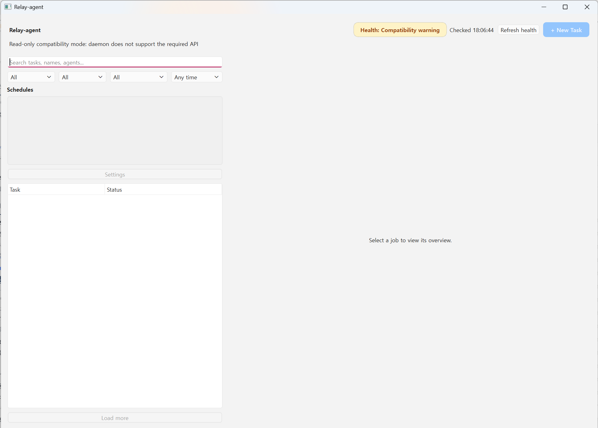
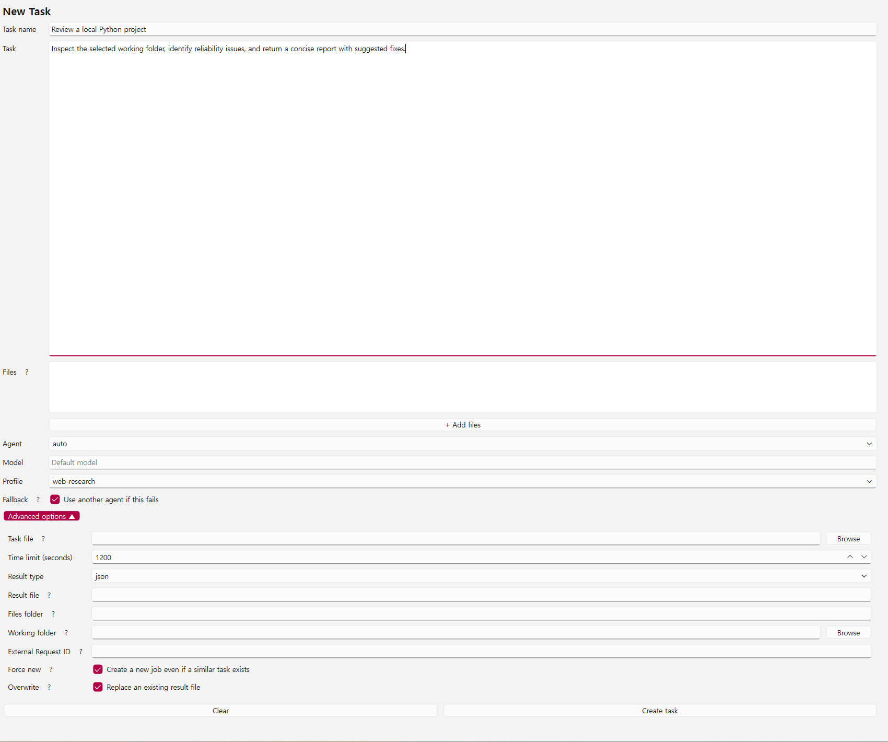

<div align="center">
  <h1>🚀 Relay</h1>
  <p><strong>Turn AI CLI work into durable, inspectable, reviewable workflows.</strong></p>
  <p>Tasks · Projects · Artifacts · Review gates · Routines · Desktop GUI · CLI · Local daemon</p>

  <p>
    <a href="https://github.com/miter37/Relay-agent/actions/workflows/ci.yml"></a>
    <a href="https://github.com/miter37/Relay-agent/releases"></a>
    <a href="https://www.python.org/downloads/"></a>
    <a href="https://github.com/miter37/Relay-agent/blob/master/LICENSE"></a>
    
  </p>
</div>

Relay is a local control plane for AI work. Define reusable Tasks, connect them into multi-step Projects, run Claude Code, Codex CLI, Antigravity, or manifest-backed custom Agent Apps, and decide what becomes a trusted result.

Humans and automation agents use the same authenticated daemon, SQLite history, artifact lineage, and delivery contract. A one-off request, a repeatable Project Run, and a scheduled Routine are all observable work with durable evidence—not disappearing terminal output.

<p align="center">
  
</p>

<p align="center"><em>Monitor Relay health, search and filter Task Run history, and inspect selected work from the desktop dashboard.</em></p>

> **Reliability boundary:** Relay validates execution, result-file creation, encoding, schemas, artifact paths, isolation, and delivery. Optional review gates help a human or a configured Project Orchestrator inspect a candidate before publication, but Relay does not claim that AI-generated content is factually correct or reasoning-quality verified.

## Contents

- [Why Relay](#why-relay)
- [The Relay workflow](#the-relay-workflow)
- [Core concepts](#core-concepts)
- [Requirements](#requirements)
- [Quick start: desktop GUI](#quick-start-desktop-gui)
- [Portable and CLI-only installation](#portable-and-cli-only-installation)
- [Desktop workflow](#desktop-workflow)
- [CLI workflow](#cli-workflow)
- [Projects, review gates, and Project Runs](#projects-review-gates-and-project-runs)
- [Routines and scheduled work](#routines-and-scheduled-work)
- [Safe work in a real folder](#safe-work-in-a-real-folder)
- [Custom Agent Apps](#custom-agent-apps)
- [Automation with OpenClaw or Hermes](#automation-with-openclaw-or-hermes)
- [Results, security, and operations](#results-security-and-operations)
- [Documentation](#documentation)

## Why Relay

AI CLIs are excellent workers, but a serious workflow also needs a place to define the work, connect outputs, observe attempts, preserve evidence, and decide whether a result is ready to use. Relay provides that control and delivery layer locally.

- **Durable work model:** Turn instructions into reusable Tasks, then compose them into explicit Project DAGs with named Artifact inputs and outputs.
- **Evidence, not just output:** Preserve attempts, progress diagnostics, logs, events, receipts, result files, Artifact metadata, and immutable lineage in one local history.
- **A deliberate publication boundary:** Keep successful candidates in review until a human or configured Project Orchestrator confirms them; add feedback and rerun when the result needs work.
- **Human and agent parity:** Use the desktop GUI, CLI, or authenticated daemon API without creating separate execution semantics or histories.
- **Safe file delivery:** Run in an isolated working copy, validate the changed-file set, and apply only verified changes to a requested real folder while retaining Artifact copies.
- **Operational automation:** Run Tasks or Projects on timezone-aware Schedules/Routines, inspect operational status, handle approvals and attention items, and consume machine-readable receipts.
- **Worker flexibility with guardrails:** Use Claude Code, Codex CLI, Antigravity, or manifest-backed custom Agent Apps with deep capability tests, model discovery, fallback controls, and per-Agent security settings.
- **Bounded agent assistance:** Let a Project Orchestrator narrate failures and make run-scoped, budgeted repairs without mutating the registered Project or Task definition.

## The Relay workflow

```text
Define       →   Run             →   Inspect                 →   Decide            →   Reuse or repeat
Task/Project     Worker CLI          attempts, logs,          candidate result       confirm Artifact,
review rules     or Routine          files, lineage,          and evidence           give feedback,
                                       Project pipeline                               rerun, or stop
```

The same lifecycle is available from the GUI and from automation:

1. Define a Task or Project and its input/output contracts.
2. Run it with a built-in or custom Agent App, manually or through a Routine.
3. Follow progress and inspect the result, generated files, attempts, and Artifact lineage.
4. If a review gate is enabled, confirm the candidate—or leave a comment and rerun it.
5. Reuse only confirmed Artifacts in later work, or inspect the full receipt when diagnosing a failed run.

## Core concepts

| Concept | What it means |
| --- | --- |
| **Task** | A reusable instruction and delivery contract for one unit of AI work. |
| **Task Run** | One execution record, including inputs, attempts, status, logs, result, and delivered files. |
| **Project** | A persistent multi-step workflow that connects Tasks through explicit Artifact roles. |
| **Project Run** | One execution of a Project, shown as a pipeline with step state, attempts, reviews, and evidence. |
| **Artifact** | A delivered result with an immutable UID that can be inspected, traced, and reused safely. |
| **Review gate** | An optional publication checkpoint: human or Orchestrator confirms, rejects, or requests a bounded rerun. |
| **Routine** | A timezone-aware schedule for running a Task or Project through the local daemon. |
| **Agent App** | A registered local AI CLI with a validated manifest, capabilities, model options, and environment policy. |

Relay's reliability guarantee is about the boundary around AI execution: did the worker run, did it produce the requested contract, and was the result delivered safely? Review gates make readiness explicit without pretending that a process check is a quality guarantee.

## Requirements

- Windows 11, Linux, or macOS
- Python 3.11+
- Git for a clone-based source installation
- At least one installed and logged-in Agent CLI:
  - `claude`
  - `codex`
  - `agy` — optional and gated behind additional security verification
- PySide6 6.8+ for the desktop GUI

For unattended external-agent or service operation, use a dedicated low-privilege OS account. Interactive desktop use does not require a separate account.

The CI matrix runs on Windows, macOS, and Linux with Python 3.11–3.13. CI validates Relay with mock provider CLIs; live provider behavior depends on the installed CLI version, account, and platform. Run a deep worker audit on every target machine and after each provider CLI upgrade.

## Quick start: desktop GUI

Install the project and its optional GUI dependency from a clone:

```sh
git clone https://github.com/miter37/Relay-agent.git
cd Relay-agent
python -m pip install ".[gui]"
relay init
```

Verify each Agent you intend to use:

```sh
relay doctor --worker claude --deep
relay doctor --worker codex --deep
```

Then open the desktop app:

```sh
relay --gui
```

The GUI connects to the local Relay daemon and starts it automatically by default. Set `daemon_auto_start` to `false` only when daemon startup is managed separately.

### If the GUI opens in compatibility mode

Compatibility mode protects the history database and disables write actions when the running daemon is older, newer, or using a different Relay Home. Restart the daemon with the same Relay installation:

```sh
relay daemon stop
relay daemon start
relay --gui
```

If the warning remains, confirm that the shell and GUI resolve the same `relay` command and `RELAY_HOME`.

## Portable and CLI-only installation

Relay's core CLI does not require the Qt GUI packages. A fresh clone can build the self-contained `relay.pyz` application with:

```sh
python build_release.py
```

### Windows

```powershell
Set-ExecutionPolicy -Scope Process Bypass
.\scripts\install_windows.ps1
```

### Linux and macOS

```sh
chmod +x scripts/install_unix.sh
./scripts/install_unix.sh
```

The installer builds `relay.pyz` when it is not already present, copies it into the user install directory, initializes Relay Home, and adds a launcher. Open a new terminal after installation if the command is not yet on `PATH`.

To add the GUI to a portable installation, install PySide6 into the Python interpreter used by the launcher:

```sh
python -m pip install "PySide6>=6.8,<7"
relay --gui
```

Prebuilt `relay.pyz` and checksum files are also available from the [latest release](https://github.com/miter37/Relay-agent/releases/latest).

## Desktop workflow

### 1. Create a task

Select **+ New Task** and provide as much or as little configuration as needed:

- optional task name
- inline task text or a UTF-8 task file
- local attachments, or result and artifact files selected from a completed Task Run ID
- Agent and model
- execution profile
- fallback preference
- time limit
- JSON or text result
- result and generated-files locations
- optional real working folder
- external request ID and duplicate-control options

<p align="center">
  
</p>

<p align="center"><em>The New Task form exposes the same Agent, model, fallback, file, result, and working-folder controls available through the CLI.</em></p>

Use **+ Add from Task Run ID** under **Files** to reuse work from an earlier Task Run. Relay shows the result and delivered
artifacts that still exist on disk; select one or more and they become ordinary attachments to the new task. This
does not create a dependency on running or queued work, so the source Task Run must have already delivered its files.

### 2. Observe the Task Run

The Task Run detail view separates the most useful information:

- **Overview:** status, Agent, model, timestamps, source, output locations, and actions
- **Task:** the submitted instruction
- **Progress:** process and activity diagnostics
- **Answer:** readable final answer with copy support
- **Result:** the complete delivered result
- **Files:** generated artifact metadata
- **Logs:** stdout, stderr, progress-check results, and attempt selection
- **Events:** lifecycle history

Use **Check progress** when a running Task Run appears quiet. Relay inspects the process and its recent activity without messaging or interrupting the Agent.

### 3. Recover or repeat work

Active Task Runs can be stopped. Completed replayable Task Runs can be run again, and output folders can be opened directly from the desktop app. Search and filters make older work easier to find by task text, name, Agent, status, source, or time.

## CLI workflow

The desktop app is optional. Every ordinary Task Run can be submitted and inspected from a terminal.

### Synchronous task

```sh
relay run "Review this repository and identify reliability risks" --worker codex
```

`--worker codex` means “try Codex first, then use configured fallbacks if necessary.” Add `--no-fallback` when only that Agent may run.

### Structured task file

```powershell
relay run `
  --task-file "D:\RelayInput\request.md" `
  --attach "D:\RelayInput\report.pdf" `
  --worker claude `
  --format json `
  --machine
```

### Background task

```sh
relay submit \
  --task-file "task.md" \
  --worker codex \
  --request-id "conversation-42-task-7-codex" \
  --no-fallback \
  --machine
```

Then use the returned Task Run ID:

```sh
relay wait <task_run_id> --machine
relay result <task_run_id> --machine
```

`request_id` is an idempotency key for one logical external request. Reusing it returns the existing Task Run even if a local task file has changed. Use a unique value such as `<conversation>-<task>-<agent>`.

## Projects, review gates, and Project Runs

Use a Project when the work has a shape worth preserving: research feeding strategy, analysis feeding a proposal, or several independent Tasks converging on one deliverable. A Project stores the graph, the Task snapshots, named input/output roles, and the final-output contract. It does not rely on agents guessing which file to pass to the next step.

```sh
relay project schema --machine
relay project create --file project.json --machine
relay project run <project_id> --machine
relay project-run show <project_run_id> --machine
relay project-run steps <project_run_id> --machine
relay project-run receipt <project_run_id> --machine
```

In the desktop app, the Project Run view makes the run understandable at a glance:

- **Pipeline** shows topology and current state, with final outputs easy to find.
- **Artifacts** previews the final deliverable first, then the Task Artifacts behind it.
- **Timeline** shows attempts, retries, and steps that have not started.
- **Inspector** exposes the selected step's inputs, output roles, receipt, and evidence without hiding the graph.
- **Orchestrator** shows narration, repair decisions, budgets, and the boundary of any run-scoped intervention.

### Optional result review

A review gate is a publication checkpoint, not a second execution status. A Task or Project node can finish producing a candidate while Relay keeps its result outside normal Artifact reuse until it is confirmed.

- **Human review:** inspect the candidate, generated files, working-folder delta, and run evidence; confirm, reject, or add a comment and rerun.
- **Orchestrator review:** provide explicit evaluation guidelines and a maximum automatic rerun count. The Orchestrator may approve or request a rerun within that budget; missing evidence, malformed decisions, errors, or an exhausted budget hand off to a human.
- **Review history:** each review round records its reviewer, decision, feedback, candidate Artifact, and rerun relationship so the Project Run tells the whole story.

Configure a Project node without rewriting its full definition:

```sh
relay project review-config <project_id> \
  --node research \
  --reviewer orchestrator \
  --guidelines-file review-guidelines.md \
  --max-reruns 2 \
  --machine
```

Inspect and resolve review work from the CLI, GUI Reviews Inbox, or daemon API:

```sh
relay review list --status pending --machine
relay review show <review_id> --machine
relay review confirm <review_id> --machine
relay review rerun <review_id> --comment "Add sources for the market-size claim" --machine
```

The Orchestrator is intentionally bounded. It can narrate a failure and repair a single Project Run through permitted actions such as retrying, switching to an available worker, rebinding a produced Artifact role, or appending a run-scoped instruction. It cannot silently rewrite the registered Project or Task definition, add nodes, or change the final-output contract.

## Routines and scheduled work

Run a Task or Project repeatedly through the local daemon with a timezone-aware Routine. Daily, weekly, monthly, every-N-days, and one-time rules support previews, pause/resume, manual runs, history, and safe retention. Scheduled executions remain ordinary Task Runs or Project Runs, so their results and evidence stay in the same history.

```sh
relay routine preview --type daily --time 09:00 --timezone Asia/Seoul --machine
relay routine list --machine
relay routine run-now <routine_id> --machine
relay routine runs <routine_id> --machine
```

For the legacy Task Run scheduling flow, Relay also retains the `schedule` CLI and its compatibility behavior. Deleting a schedule or routine does not delete the work and outputs it already created.

## Safe work in a real folder

Use `--target` when the Agent must create or modify files in an existing directory:

```powershell
relay run "Review and improve this code" `
  --worker codex `
  --target "D:\project" `
  --artifacts "D:\relay-copies"
```

Relay:

1. creates an isolated working copy;
2. runs the Agent inside that workspace;
3. validates paths and the changed-file set;
4. applies only verified changes to the requested folder; and
5. keeps a separate copy of changed or created files in the artifacts location.

`--out` controls the JSON or text result file. `--artifacts` controls generated-file delivery. The GUI exposes the same behavior as **Working folder** and **Files folder**.

## Custom Agent Apps

The built-in Agents cover common workflows, but Relay can manage other local AI CLIs through manifest-backed Agent Apps.

Open **Settings → Agent Apps** to:

- register an executable and argument template;
- choose request and result modes;
- declare supported result formats and artifact support;
- configure model discovery and model arguments;
- declare required environment variable names and safety capabilities;
- run a deep test before saving or enabling the Agent;
- edit, retest, enable, disable, or recoverably delete an Agent App.

Changing a runtime definition invalidates its previous test. The Agent remains unavailable until the changed definition passes another deep test.

CLI inspection and lifecycle commands use the same registry:

```sh
relay agent-app list
relay agent-app show opencode
relay agent-app test opencode
relay agent-app enable opencode
```

The original interactive registration flow remains available:

```sh
relay add-agent opencode
relay doctor --worker opencode --deep
relay run --worker opencode "Hello"
```

Run `relay add-agent --help` and `relay agent-app --help` for the complete command set.

## Automation with OpenClaw or Hermes

Register `skills/hermes-relay/SKILL.md` (skill name: `use_relay_agent`) in the calling environment. An always-on agent can then submit long-running work to one or more worker CLIs and collect the final receipts asynchronously.

For independent multi-Agent comparison, submit one Task Run per Agent with a unique request ID and `--no-fallback`:

```sh
relay submit --task-file task.md --worker claude --request-id arch-claude --caller hermes --no-fallback --machine
relay submit --task-file task.md --worker codex --request-id arch-codex --caller hermes --no-fallback --machine
relay submit --task-file task.md --worker antigravity --request-id arch-antigravity --caller hermes --no-fallback --machine
```

For unattended execution, configure Relay under a dedicated low-privilege account with explicit filesystem allowlists and ACL isolation.

### Agent-driven Task discovery

Agents should inspect the bounded catalog before submitting new work. Relay provides metadata and stable IDs; the Agent chooses and compares candidates.

```sh
relay catalog tasks --machine
relay task show <TASK_ID> --machine
relay catalog task-runs --status completed --machine
relay result <TASK_RUN_ID> --machine
relay artifact show <ARTIFACT_UID> --machine
relay artifact lineage <ARTIFACT_UID> --machine
relay catalog projects --machine
relay project show <PROJECT_ID> --machine
relay catalog project-runs --status completed --machine
relay project-run show <PROJECT_RUN_ID> --machine
```

Use `task_summary`, `result_summary`, and `failure_reason` to narrow candidates, then read the selected Task definition or receipt. Reuse prior output by Artifact UID, not by an arbitrary file path:

```sh
relay run "Update the previous report" --input-artifact <ARTIFACT_UID>=A1 --machine
relay run-lineage <TASK_RUN_ID> --machine
```

Relay does not rank or recommend candidates. Existing `relay search --kind runs|artifacts` remains available for explicit full-text or Artifact searches.

## Results, security, and operations

### JSON result contract

When `--format json` is selected, the delivered result follows this shape:

```json
{
  "schema_version": "1.0",
  "status": "complete",
  "answer": "The requested analysis...",
  "sources": ["https://example.com"],
  "uncertainties": [],
  "missing_items": [],
  "artifacts": [
    {
      "name": "report.md",
      "relative_path": "report.md",
      "description": "Generated report"
    }
  ]
}
```

The Relay receipt status reports whether the CLI execution and delivery completed. The `status` inside the result file is the Agent's self-reported task outcome. Check both.

### Model discovery

```sh
relay models
relay models --worker codex --refresh
relay model-check --worker claude --model sonnet --machine
```

Codex and Antigravity can expose account-aware model catalogs when their CLIs support it. Claude Code does not expose a complete non-interactive account catalog, so Relay may combine configured and known candidates. A failed Claude model probe can also mean expired authentication, quota exhaustion, rate limiting, or a network timeout.

### Security posture

Inspect the current isolation and allowlist state:

```sh
relay security --machine
```

Full Access Mode is a separate per-Agent switch. It disables that Agent CLI's permission checks or sandbox restrictions and applies immediately to the running daemon:

```sh
relay security --worker codex --machine
relay security --enable-full-access codex --machine
relay security --disable-full-access codex --machine
```

The same switches are available in **Settings → General**. Use Full Access Mode only for trusted tasks under a dedicated low-privilege OS account.

Antigravity requires an explicit deep audit and security opt-in:

```sh
relay doctor --worker antigravity --deep
relay config set workers.antigravity.security_verified true
relay config enable-worker antigravity
```

### Cleanup

Relay automatically expires internal staging and workspace directories while preserving delivered result and artifact files:

- completed workspaces: 7 days
- partial workspaces: 14 days
- failed workspaces: 30 days
- cancelled workspaces: 14 days
- orphan workspaces: 7 days

```sh
relay cleanup --status
```

## Documentation

- [Agent delegation manual](manual.md)
- [Known limitations](docs/KNOWN_LIMITATIONS.md)
- [Security guide](docs/SECURITY.md)
- [Cross-platform notes](docs/CROSS_PLATFORM.md)
- [Database migration notes](docs/DATABASE_MIGRATION.md)
- [Automatic cleanup policy](docs/AUTOMATIC_CLEANUP.md)
- [Release notes](RELEASE_NOTES.md)
- [Project wiki index](wiki/index.md)

<div align="center">
  <i>Built for AI work that should finish, be inspectable, and be safe to publish.</i>
</div>
