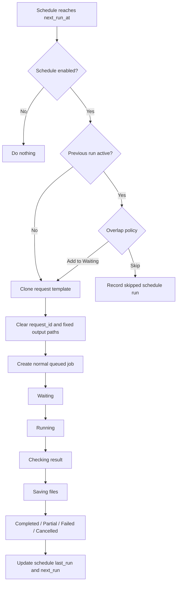

# Relay-agent GUI Development Plan v1.0

- **Repository:** `miter37/Relay-agent`
- **Document date:** 2026-07-23
- **Target command:** `relay --gui`
- **Primary platforms:** Windows 11, Linux, macOS
- **UI language:** Simple English
- **Document language:** Korean, with proposed UI labels and messages written in English
- **Status:** First detailed implementation plan

---

## 1. Purpose

Relay-agent의 기존 CLI 기능을 유지하면서, 사람이 작업을 등록하고 진행 상태를 확인하며 결과·로그·산출물·반복 일정을 관리할 수 있는 로컬 데스크톱 GUI를 추가한다.

GUI는 별도의 실행 시스템이 아니다. 기존 Relay의 다음 요소를 그대로 공유하는 **visual client**여야 한다.

- `RelayEngine`
- local daemon
- SQLite job history
- worker adapters
- validation and atomic delivery
- cleanup policy
- configuration
- capability audit / deep doctor

따라서 CLI, Hermes, GUI, Schedule이 등록한 모든 작업은 하나의 작업 이력과 하나의 실행 큐에서 관리된다.

---

## 2. Final product definition

`relay --gui`를 실행하면 Relay 데스크톱 앱이 열린다.

GUI의 중심은 대시보드가 아니라 다음 두 영역이다.

1. **Sidebar**
   - Waiting
   - Running
   - Completed
   - Schedules
   - Settings

2. **Main panel**
   - 사이드바에서 선택한 작업 또는 Schedule의 상세 내용 표시
   - 새 작업 등록
   - 작업 결과·산출물·로그 확인
   - 설정 변경
   - 신규 Agent App 등록

GUI가 닫혀도 daemon이 살아 있다면 작업과 Schedule은 계속 실행된다.

---

## 3. Fixed design decisions

### 3.1 CLI jobs must appear in the GUI

당연히 기존 CLI에서 실행한 작업도 GUI에 보여야 한다.

```text
relay "Research today's semiconductor news"
relay run --task-file task.md
relay submit --task-file task.md
Hermes → relay submit
GUI → Create Task
Schedule → queue JobRequest
```

위 모든 경로는 동일한 Relay home과 동일한 SQLite database를 사용한다.

```text
                         ┌──────────────┐
CLI ────────────────────▶│              │
Hermes ─────────────────▶│ Relay daemon │
GUI ────────────────────▶│  + Engine    │
Schedule engine ─────────▶│              │
                         └──────┬───────┘
                                │
                                ▼
                         SQLite job history
                                │
                                ▼
                         GUI sidebar and detail
```

GUI는 “GUI에서 만든 작업만” 표시하는 별도 DB를 만들면 안 된다.

#### Visibility condition

CLI와 GUI가 같은 기록을 보려면 다음 조건이 같아야 한다.

- 같은 OS user
- 같은 `RELAY_HOME`
- 같은 `database_path`

GUI 하단 상태 영역에 현재 Relay home을 표시한다.

```text
Relay Home: C:\Users\name\AppData\Local\Relay
```

CLI가 별도의 `RELAY_HOME` 환경변수로 실행되었다면 해당 작업은 다른 DB에 있으므로 현재 GUI에 나타나지 않는다. 향후 “Open another Relay Home” 기능을 추가할 수 있지만 MVP 범위에서는 제외한다.

---

### 3.2 A Schedule is created from a successful job

초기 버전에서는 새 작업을 곧바로 반복 일정으로 등록하지 않는다.

```text
Create Task
    ↓
Run once
    ↓
Completed successfully
    ↓
Schedule this task
    ↓
Choose frequency and time
    ↓
Schedule created
```

이 정책의 목적은 다음과 같다.

- 실제로 성공한 요청만 반복 실행
- 잘못된 Agent, model, path, attachment 설정이 계속 실패하는 상황 방지
- 첫 실행 결과를 확인한 후 반복 여부 결정
- Schedule 등록 UI를 단순화

`Schedule this task` 버튼은 기본적으로 `COMPLETED` 작업에만 표시한다.

`PARTIAL`, `FAILED`, `CANCELLED` 작업에는 표시하지 않는다. 먼저 재실행하여 완전한 성공을 확인하도록 한다.

---

### 3.3 Scheduled runs are normal jobs

Schedule은 작업을 직접 실행하지 않는다. 정해진 시각이 되면 기존 `JobRequest`를 복제하여 일반 작업 큐에 넣는다.

```text
Schedule reached
      │
      ▼
Create a normal JobRequest
      │
      ▼
Waiting
      │
      ▼
Running
      │
      ▼
Completed / Partial / Failed / Cancelled
```

따라서 Schedule 실행분도 사이드바의 다음 위치에 동일하게 표시된다.

- 실행 전: **Waiting**
- 실행 중: **Running**
- 종료 후: **Completed**

Schedule 상세 화면에는 해당 Schedule이 만든 개별 실행 기록도 따로 연결한다.

---

### 3.4 Simple English UI

모든 메뉴명, 버튼, 도움말, 오류 안내는 가능한 한 쉬운 영어를 사용한다.

예:

| Avoid | Use |
|---|---|
| Queue | Waiting |
| Trigger cron | Run now |
| Execution history | Run history |
| Configure recurrence | Choose a schedule |
| Enable fallback | Use another agent if this fails |
| Artifact directory | Files folder |
| Submit request | Create task |
| Terminate process | Stop task |
| Capability audit | Test agent |
| Invocation parameters | Command options |

기술 용어가 꼭 필요한 경우 짧은 설명을 함께 표시한다.

```text
Request ID
Used to prevent the same task from being created twice.
```

---

## 4. Recommended GUI technology

### 4.1 Recommendation: PySide6

GUI는 `PySide6` 기반 데스크톱 앱으로 구현하는 것을 권장한다.

이유:

- Windows, Linux, macOS 지원
- modern desktop UI 구성 용이
- split panel, tree/list, tabs, dialogs 지원
- file picker와 native menu 지원
- system tray와 desktop notification 확장 가능
- 대용량 로그 표시와 background polling 구현이 비교적 안정적
- Tkinter보다 화면 품질과 복잡한 레이아웃 구현성이 높음

### 4.2 Keep headless CLI lightweight

현재 CLI의 기본 의존성은 가볍게 유지한다.

```toml
[project.optional-dependencies]
gui = [
  "PySide6>=6.8,<7",
  "tzdata>=2025.2"
]
```

권장 설치 정책:

- 일반 Windows/macOS/Linux 설치 스크립트: GUI extra 포함
- headless server 설치: base package만 설치 가능
- GUI 의존성이 없을 때 `relay --gui` 실행:

```text
GUI support is not installed.
Run: pip install "relay-ai-cli-broker[gui]"
```

---

## 5. Main information architecture

```text
Relay-agent
│
├─ New Task
│
├─ Waiting
│   └─ jobs waiting for an agent
│
├─ Running
│   └─ active jobs
│
├─ Completed
│   ├─ Search
│   ├─ Filters
│   ├─ Today
│   ├─ Yesterday
│   └─ older dates
│
├─ Schedules
│   ├─ Active
│   ├─ Paused
│   └─ Schedule errors
│
└─ Settings
    ├─ General
    ├─ Agents
    ├─ Paths
    ├─ Task rules
    ├─ Cleanup
    ├─ Security
    └─ Agent Apps
```

사이드바에는 기술 용어인 `Cron Jobs`보다 쉬운 `Schedules`를 사용한다. 내부 코드와 개발 문서에서는 cron 또는 schedule이라는 용어를 사용할 수 있다.

---

## 6. Main window layout

```text
┌───────────────────────────────────────────────────────────────────────────────┐
│ Relay-agent                            Daemon: Running       [ + New Task ]   │
├──────────────────────────┬────────────────────────────────────────────────────┤
│                          │                                                    │
│ ▾ Waiting             3  │                                                    │
│   Market news research   │                                                    │
│   Review report.pdf      │                                                    │
│   Check project code     │                                                    │
│                          │                                                    │
│ ▾ Running             1  │                                                    │
│   ● Semiconductor news   │                   Main panel                       │
│     Codex · 04:31        │                                                    │
│                          │    Selected job, schedule, or settings page        │
│ ▾ Completed              │                                                    │
│   [ Search jobs...    ]  │                                                    │
│   [ All ▼ ] [ Filter ]   │                                                    │
│                          │                                                    │
│   ▾ Today             8  │                                                    │
│      ✓ TSMC analysis     │                                                    │
│      ◐ Market research   │                                                    │
│      × PDF extraction    │                                                    │
│   ▸ Yesterday        12  │                                                    │
│   ▸ Jul 21            9  │                                                    │
│                          │                                                    │
│ ▾ Schedules           4  │                                                    │
│   ● Daily market news    │                                                    │
│   ● Weekly stock review  │                                                    │
│   ○ Monthly report       │                                                    │
│                          │                                                    │
│ ⚙ Settings               │                                                    │
├──────────────────────────┴────────────────────────────────────────────────────┤
│ Claude: Ready  |  Codex: Ready  |  Antigravity: Off  |  Running: 1 of 2     │
│ Relay Home: C:\Users\name\AppData\Local\Relay                                │
└───────────────────────────────────────────────────────────────────────────────┘
```

### Layout rules

- 기본 sidebar 폭: 320px
- 사용자가 drag하여 폭 조절 가능
- 최소 sidebar 폭: 260px
- 최대 sidebar 폭: 480px
- main panel은 남은 공간 사용
- 창 크기와 sidebar 폭을 로컬 설정에 저장
- 최소 권장 해상도: 1280×720
- 4K 화면에서도 글자가 지나치게 작아지지 않도록 OS scale 사용

---

## 7. Sidebar behavior

### 7.1 Waiting

상태가 다음 중 하나인 작업:

- `CREATED`
- `QUEUED`
- 필요 시 `PREPARING`을 짧게 Waiting에 포함하거나 Running으로 즉시 이동

표시 예:

```text
Market news research
Codex first · Added 08:32
```

클릭하면 main panel에서 다음을 보여준다.

- task title
- full task text
- attachments
- requested agent
- model
- profile
- fallback rule
- result format
- timeout
- output paths
- created time
- source: CLI / GUI / Hermes / Schedule
- schedule name, when applicable

지원 동작:

- `Edit` — 아직 실제 실행이 시작되지 않은 경우
- `Stop`
- `Run first` — optional, queue priority 기능이 구현된 경우
- `Copy job ID`

MVP에서는 queue priority 변경은 제외할 수 있다. 이 경우 `Run first` 버튼도 제외한다.

---

### 7.2 Running

상태가 다음 중 하나인 작업:

- `PREPARING`
- `RUNNING`
- `VALIDATING`
- `DELIVERING`
- `CANCEL_REQUESTED`

표시 예:

```text
● Semiconductor news
Codex · Running · 04:31
```

실제 percentage는 표시하지 않는다. Worker가 전체 작업량을 알 수 없기 때문이다.

대신 단계형 진행 표시를 사용한다.

```text
Prepare → Run → Check result → Save files → Done
          ━━━
```

UI mapping:

| Internal status | Easy English |
|---|---|
| PREPARING | Preparing |
| RUNNING | Running |
| VALIDATING | Checking result |
| DELIVERING | Saving files |
| CANCEL_REQUESTED | Stopping |

---

### 7.3 Completed

이 섹션은 실제로 모든 종료 작업을 포함한다.

- `COMPLETED`
- `PARTIAL`
- `FAILED`
- `CANCELLED`

사용자에게는 쉬운 메뉴명인 **Completed**를 사용한다.

상태 아이콘:

| Status | Icon | Label |
|---|---:|---|
| COMPLETED | ✓ | Completed |
| PARTIAL | ◐ | Partial |
| FAILED | × | Failed |
| CANCELLED | — | Cancelled |

#### Date grouping

최근 날짜가 위로 온다.

```text
▾ Today · 8
   ✓ TSMC analysis             08:20
   ◐ Data center research      07:43
   × PDF chart extraction      06:15

▸ Yesterday · 12
▸ Jul 21, 2026 · 9
▸ Jul 20, 2026 · 4
```

기본 규칙:

- `Today`: open
- `Yesterday`: closed
- older dates: closed
- 날짜 안에서는 최근 종료 순
- timezone은 GUI의 local timezone 사용
- 7일 이후는 필요할 때 추가 로드
- 무한 스크롤 또는 `Load more` 지원
- 날짜 header를 누르면 open/close

---

### 7.4 Completed search and filters

Completed header 아래에 검색창과 필터 버튼을 둔다.

```text
Completed
[ Search completed jobs...             ]
[ All results ▼ ] [ Agent ▼ ] [ Date ▼ ]
```

검색 대상:

- task title
- task text or saved task preview
- job ID
- agent name
- model
- profile
- error code
- Schedule name
- attachment file name, when indexed

필터:

```text
Result
- All results
- Completed
- Partial
- Failed
- Cancelled

Agent
- All agents
- Claude
- Codex
- Antigravity
- custom agents

Source
- All sources
- CLI
- GUI
- Hermes
- Schedule

Date
- Any time
- Today
- Last 7 days
- Last 30 days
- Custom range
```

검색 결과도 날짜별 grouping을 유지한다. 매칭 항목이 없는 날짜 group은 숨긴다.

검색은 debounce 250~400ms를 적용하여 입력할 때마다 DB를 과도하게 조회하지 않도록 한다.

#### Recommended API

```http
GET /jobs
    ?terminal=true
    &query=semiconductor
    &status=COMPLETED,PARTIAL
    &agent=codex
    &source=schedule
    &date_from=2026-07-01
    &date_to=2026-07-23
    &limit=100
    &cursor=...
```

---

### 7.5 Schedules

표시 예:

```text
▾ Schedules · 4
   ● Daily market news
     Next: Today 13:00

   ● Weekly stock review
     Next: Fri 07:00

   ○ Monthly report
     Paused

   × Data collection
     Last run failed
```

상태:

| Icon | Meaning |
|---:|---|
| ● | Active |
| ○ | Paused |
| × | Needs attention |

Schedule 항목을 클릭하면 main panel에 등록 내용과 다음 실행 시각을 표시한다.

---

## 8. Main panel: job details

작업을 선택하면 하나의 detail view에서 상태에 따라 기본 tab만 다르게 선택한다.

```text
Market news research                                      Completed

Codex · gpt-5.x · web-research
Created 08:31 · Started 08:32 · Finished 08:40
Source: CLI

[ Overview ] [ Task ] [ Progress ] [ Result ] [ Files ] [ Logs ] [ Events ]
```

기본 tab:

| Job state | Default tab |
|---|---|
| Waiting | Task |
| Running | Progress |
| Completed | Result |
| Partial | Result |
| Failed | Logs |
| Cancelled | Overview |

---

### 8.1 Overview tab

```text
Status                 Completed
Requested agent        Claude
Actual agent           Codex
Model                  gpt-5.x
Profile                web-research
Result type            JSON
Fallback               On
Created                Jul 23, 2026 08:31
Started                Jul 23, 2026 08:32
Finished               Jul 23, 2026 08:40
Result file            C:\...\result.json
Files folder           C:\...\artifacts
Source                 CLI
```

Fallback flow:

```text
Claude
  └─ Sign-in required
       ↓
Codex
  └─ Completed
```

Actions:

```text
[ Run again ] [ Copy settings ] [ Open result ] [ Open folder ]
```

성공 작업에는 다음 버튼을 추가한다.

```text
[ Schedule this task ]
```

---

### 8.2 Task tab

표시 내용:

- task title
- original task text
- task file path, if applicable
- attachments
- requested agent
- model
- profile
- fallback
- timeout
- caller
- request ID
- workspace
- output configuration

기존 historical job에 별도 title이 없으면 다음 순서로 생성한다.

1. task의 첫 번째 non-empty line
2. 최대 60자
3. 줄바꿈 제거
4. task를 읽을 수 없으면 `Job <short job id>`

---

### 8.3 Progress tab

```text
Current step

Prepare        Done
Run            In progress
Check result   Waiting
Save files     Waiting
Done           Waiting
```

실행 attempt 정보:

```text
Attempt 1
Agent          Claude
Result         Failed
Reason         Sign-in required

Attempt 2
Agent          Codex
Result         Running
Elapsed        04:31
```

Actions:

```text
[ Stop task ] [ Show live log ]
```

---

### 8.4 Result tab

JSON 결과:

```text
Answer
────────────────────────────────────────
The main findings are...

Sources · 8
Uncertainties · 2
Missing items · 0

[ Show sources ] [ Show raw JSON ] [ Open result ]
```

TXT 결과:

- readable monospaced or document text view
- word wrap toggle
- copy all
- open external file

결과 검증 안내는 쉬운 영어로 표시한다.

```text
Relay checked the file format and delivery.
It did not check whether the answer is factually correct.
```

---

### 8.5 Files tab

```text
Name                     Type        Size       Actions
market_report.html       HTML        420 KB     Open · Show in folder
chart.png                Image       860 KB     Preview · Open
source_data.csv          CSV          72 KB     Open · Show in folder
```

MVP preview:

- PNG/JPEG/WebP: internal preview
- TXT/JSON/CSV/MD: internal text preview with size limit
- other formats: open with default OS app

---

### 8.6 Logs tab

```text
[ Attempt 1: Claude ▼ ] [ stdout ] [ stderr ] [ Errors only ]

08:32:01 ...
08:32:03 ...
```

기능:

- 1~2초 단위 tail
- auto-scroll on/off
- search in log
- errors only
- copy selected text
- open full log file
- 대용량 파일 전체를 한 번에 메모리에 올리지 않음

---

### 8.7 Events tab

```text
08:31:58  Job created
08:32:00  Preparing
08:32:02  Claude started
08:32:14  Claude failed: Sign-in required
08:32:15  Codex started
08:39:52  Checking result
08:40:01  Saving files
08:40:03  Completed
```

내부 event code는 유지하되 화면에는 쉬운 영어로 변환한다.

---

## 9. New Task screen

`+ New Task` 버튼을 누르면 main panel 전체가 등록 화면으로 바뀐다.

새 작업은 기본적으로 1회 작업이다. Schedule은 성공 후 등록한다.

```text
New Task

[ Task ] [ Agent ] [ Run options ] [ Output ] [ Advanced ]
```

---

### 9.1 Task section

```text
Task name
[ Research today's AI semiconductor news                    ]

What should the agent do?
┌────────────────────────────────────────────────────────────┐
│ Research the last 24 hours of AI semiconductor news...    │
│                                                            │
└────────────────────────────────────────────────────────────┘

Task input
(●) Write here
( ) Use a task file

Files
[ + Add files ]   report.pdf   data.xlsx

Profile
[ web-research ▼ ]
```

`Task name`은 optional이다.

비어 있으면 task 첫 줄에서 자동 생성한다.

---

### 9.2 Agent section

```text
Agent
[ Codex ▼ ]

Model
[ Default model ▼ ]                         [ Refresh ]

Use another agent if this fails
[✓]

Try in this order
1. Claude
2. Antigravity
[ Change order ]
```

현재 전역 fallback order만 지원하지만 GUI 개발과 함께 작업별 fallback list를 지원하는 것이 좋다.

New request field:

```python
fallback_workers: list[str] | None
```

- `None`: global fallback order
- list: task-specific order

---

### 9.3 Run options

```text
Run mode
(●) Run in the background
( ) Run and keep this page open

Time limit
[ 1200 ] seconds

Workspace
[ Use the default workspace ▼ ]

Create a new job even if the same task exists
[ ]

Replace an existing result file
[ ]
```

GUI 기본값은 background submit이다.

UI에 노출하지 않아도 되는 내부 옵션:

- `--machine`
- daemon token
- internal staging paths

---

### 9.4 Output section

```text
Result type
[ JSON ▼ ]

Result file
(●) Choose automatically
( ) Use this path  [____________________] [ Browse ]

Files folder
(●) Choose automatically
( ) Use this path  [____________________] [ Browse ]
```

자동 경로의 예시를 미리 보여준다.

```text
Example result path
C:\Users\name\AppData\Local\Relay\results\2026-07-23\<job-id>\result.json
```

---

### 9.5 Advanced section

```text
Caller
[ human ▼ ]

Request ID
[ Create automatically __________________ ]

Model name
[ _______________________________________ ]

Timeout
[ 1200 ]

[ ] Force a new job
[ ] Replace existing output
```

`caller`는 일반 사용자에게 혼동을 줄 수 있으므로 Advanced에 둔다.

---

### 9.6 Bottom action bar

```text
[ Show CLI command ]   [ Save as template ]   [ Clear ]   [ Create task ]
```

CLI preview example:

```powershell
relay submit `
  --task-file "C:\...\request.md" `
  --worker codex `
  --model "gpt-5.x" `
  --format json `
  --timeout 1200 `
  --attach "C:\...\report.pdf"
```

CLI preview는 실제 shell escaping 규칙을 OS별로 생성한다.

- Windows: PowerShell
- Linux/macOS: shell

---

## 10. Schedule creation from a successful job

### 10.1 Entry point

Completed job의 main panel 상단 또는 action menu:

```text
[ Run again ] [ Schedule this task ] [ Open result ] [ Open folder ]
```

`Schedule this task` 클릭 시 modal dialog를 연다.

---

### 10.2 Schedule dialog layout

```text
┌──────────────────────────────────────────────────────────────┐
│ Schedule this task                                           │
├──────────────────────────────────────────────────────────────┤
│ Task                                                         │
│ Daily market news                                            │
│ Codex · Default model · web-research                         │
│                                                              │
│ Schedule name                                                │
│ [ Daily market news______________________________________ ]  │
│                                                              │
│ Repeat                                                       │
│ [ Daily ▼ ]                                                  │
│                                                              │
│ Time                                                         │
│ [ 09:00 ] [ × ]                                              │
│ [ 13:00 ] [ × ]                                              │
│ [ + Add another time ]                                       │
│                                                              │
│ Time zone                                                    │
│ [ Asia/Seoul ▼ ]                                             │
│                                                              │
│ Next runs                                                    │
│ • Jul 24, 2026 09:00                                         │
│ • Jul 24, 2026 13:00                                         │
│ • Jul 25, 2026 09:00                                         │
│ • Jul 25, 2026 13:00                                         │
│ • Jul 26, 2026 09:00                                         │
│                                                              │
│ [ More options ]                 [ Cancel ] [ Create schedule ]│
└──────────────────────────────────────────────────────────────┘
```

Popup의 주된 목적은 실행 설정을 다시 작성하는 것이 아니라 **주기와 시각을 선택하는 것**이다.

원본 성공 작업에서 다음 값을 상속한다.

- task text
- task title
- agent
- model
- profile
- result format
- fallback settings
- timeout
- other safe request options

다음 값은 새 Schedule용으로 변경한다.

- `request_id`: clear
- `force_new`: true for each scheduled run
- `output_path`: automatic unique path
- `artifact_path`: automatic unique path
- `task_file`: clear after task text is materialized
- `caller`: `schedule`
- `submitted_via`: `schedule`
- `schedule_id`: current schedule ID
- `scheduled_for`: expected run time

---

## 11. Supported schedule types

### 11.1 Daily

필수:

- one or more times
- timezone

```text
Repeat
Daily

Time
09:00
13:00
18:30
```

Rule example:

```json
{
  "type": "daily",
  "times": ["09:00", "13:00", "18:30"],
  "timezone": "Asia/Seoul"
}
```

---

### 11.2 Weekly

필수:

- one or more weekdays
- one or more times
- timezone

```text
Repeat
Weekly

Days
[✓ Mon] [ ] Tue [✓ Wed] [ ] Thu [✓ Fri] [ ] Sat [ ] Sun

Time
07:00
18:00
```

Rule example:

```json
{
  "type": "weekly",
  "weekdays": [1, 3, 5],
  "times": ["07:00", "18:00"],
  "timezone": "Asia/Seoul"
}
```

내부 weekday numbering은 ISO Monday=1을 권장한다.

---

### 11.3 Monthly

필수:

- one or more dates
- one or more times
- timezone

```text
Repeat
Monthly

Dates
[ 1 ] [ 15 ] [ 28 ] [ + Add date ]

Time
09:00
```

Rule example:

```json
{
  "type": "monthly",
  "month_days": [1, 15, 28],
  "times": ["09:00"],
  "missing_day_policy": "skip",
  "timezone": "Asia/Seoul"
}
```

29, 30, 31일이 없는 달의 기본 정책:

```text
Skip months that do not have this date.
```

Advanced option:

```text
Use the last day of the month instead.
```

---

### 11.4 Every N days

필수:

- N
- start date / anchor date
- one or more times
- timezone

```text
Repeat
Every [ 3 ] days

Start date
[ Jul 23, 2026 ]

Time
09:00
18:00
```

Rule example:

```json
{
  "type": "n_days",
  "interval_days": 3,
  "anchor_date": "2026-07-23",
  "times": ["09:00", "18:00"],
  "timezone": "Asia/Seoul"
}
```

`Every N days`는 단순 cron expression으로 정확히 표현하기 어려우므로 내부 canonical rule JSON을 사용한다.

---

### 11.5 One time

필수:

- date
- time
- timezone

```text
Repeat
One time

Date
[ Aug 3, 2026 ]

Time
[ 10:30 ]
```

실행 후 자동으로 inactive 상태가 된다.

Rule example:

```json
{
  "type": "once",
  "run_at": "2026-08-03T10:30:00",
  "timezone": "Asia/Seoul"
}
```

---

## 12. Schedule advanced options

기본 화면에서는 숨기고 `More options`에서 연다.

### 12.1 Previous run is still active

```text
If the previous run is still active

(●) Skip this run
( ) Add this run to Waiting
```

MVP 기본값:

```text
Skip this run
```

초기 버전에서는 `Stop the old run and start a new one`은 제외하는 것을 권장한다. 작업 중단과 결과 파일 처리에서 혼란이 커질 수 있다.

---

### 12.2 Relay was not running

Schedule은 daemon이 실행 중일 때만 시간을 감지할 수 있다.

```text
If Relay was not running

(●) Skip missed runs
( ) Run once when Relay starts
```

기본값:

```text
Skip missed runs
```

향후 필요하면 grace period를 추가한다.

```text
Run once if the missed time was less than [ 12 ] hours ago.
```

---

### 12.3 Start and end

```text
Start
[ Now ▼ ]

End
(●) No end date
( ) End on [ date ]
```

MVP에서는 optional이다.

---

### 12.4 Next-run preview

Schedule 저장 전에 다음 5개 실행 시각을 반드시 표시한다.

```text
Next runs
• Jul 24, 2026 09:00
• Jul 24, 2026 13:00
• Jul 25, 2026 09:00
• Jul 25, 2026 13:00
• Jul 26, 2026 09:00
```

잘못된 date/time 조합은 저장 전에 차단한다.

---

## 13. Schedule details screen

사이드바에서 Schedule을 클릭하면 다음 화면을 표시한다.

```text
Daily market news                                      Active

Daily at 09:00 and 13:00
Time zone: Asia/Seoul

Next run
Jul 24, 2026 09:00

Last run
Jul 23, 2026 13:00 · Completed

[ Overview ] [ Task settings ] [ Run history ]
```

### 13.1 Overview

```text
Schedule             Daily
Times                09:00, 13:00
Time zone            Asia/Seoul
Next run             Jul 24, 2026 09:00
Last run             Jul 23, 2026 13:00
Previous run active  Skip this run
Missed runs          Skip
Created from         Job 20260723-...
```

Actions:

```text
[ Run now ] [ Pause ] [ Edit schedule ] [ Copy ] [ Delete ]
```

`Run now` 역시 일반 JobRequest를 queue에 추가한다.

---

### 13.2 Task settings

```text
Task name            Daily market news
Agent                Codex
Model                Default model
Profile              web-research
Fallback             Claude
Time limit           20 minutes
Result type          JSON
```

MVP에서는 task setting을 보여주기만 하고, 수정은 `Edit task settings` 버튼으로 별도 dialog에서 처리한다.

---

### 13.3 Run history

```text
Scheduled time           Started                 Result
Jul 23, 13:00            Jul 23, 13:00           Completed
Jul 23, 09:00            Jul 23, 09:00           Completed
Jul 22, 13:00            Jul 22, 13:01           Failed
Jul 22, 09:00            —                       Skipped
```

각 row를 클릭하면 해당 일반 job 상세 화면으로 이동한다.

---

## 14. Scheduled run lifecycle



모든 실행 상태는 기존 job lifecycle을 사용한다.

---

## 15. Attachment handling for Schedules

성공 작업에서 Schedule을 만들 때 원본 attachment 경로만 그대로 참조하면 안 된다.

이유:

- 원본 파일이 이동 또는 삭제될 수 있음
- 임시 폴더일 수 있음
- Schedule은 수개월 뒤에도 실행될 수 있음
- CLI 작업의 task file 경로도 사라질 수 있음

### Recommended behavior

Schedule 생성 시 다음을 수행한다.

```text
source job task text
    → materialize into schedule request template

source attachments
    → copy into persistent schedule input folder

<RELAY_HOME>/schedule-inputs/<schedule_id>/
```

Schedule template에는 복사된 persistent path를 저장한다.

```text
schedule-inputs/
└─ sch_abc123/
   ├─ request.md
   ├─ report.pdf
   └─ data.xlsx
```

Schedule 삭제 시:

- 연결된 과거 job 결과는 삭제하지 않음
- schedule input snapshot만 retention rule에 따라 삭제
- 삭제 전에 확인 dialog 표시

```text
Delete this schedule?
Past job results will not be deleted.
```

---

## 16. Daemon and auto-start requirement

Schedule이 정확히 실행되려면 daemon이 계속 살아 있어야 한다.

GUI를 닫아도 daemon은 종료하지 않는 것을 기본값으로 한다.

### First Schedule prompt

첫 Schedule 생성 시 OS auto-start가 설정되지 않았다면:

```text
Relay must keep running to start scheduled tasks.

Start Relay automatically when you sign in?

[ Not now ] [ Turn on auto-start ]
```

### Platform integration

- Windows: Task Scheduler, current user logon
- macOS: LaunchAgent
- Linux: systemd user service
- fallback: user starts daemon manually

GUI Settings:

```text
Start Relay when I sign in
[✓]
```

daemon stop confirmation:

```text
Stopping Relay will also stop scheduled tasks.

[ Cancel ] [ Stop Relay ]
```

---

## 17. GUI and daemon communication

GUI는 SQLite를 직접 수정하지 않는다.

권장 구조:

```text
GUI
 │
 │ token-authenticated local RPC
 ▼
Relay daemon
 │
 ├─ job API
 ├─ schedule API
 ├─ agent API
 ├─ settings API
 └─ cleanup API
 │
 ▼
SQLite + RelayEngine
```

이유:

- GUI와 CLI가 동시에 DB를 수정하는 충돌 방지
- validation logic 중복 방지
- queue와 Schedule 동시성 한곳에서 관리
- 보안 규칙과 path validation 재사용
- 향후 remote mode 확장 가능

GUI는 1~2초 polling으로 시작한다. 추후 Server-Sent Events 또는 local event stream을 고려할 수 있지만 MVP에는 필요하지 않다.

---

## 18. Required RPC endpoints

### 18.1 Jobs

```http
GET    /jobs
GET    /jobs/{job_id}
POST   /jobs
PATCH  /jobs/{job_id}          # waiting job only
POST   /jobs/{job_id}/cancel
POST   /jobs/{job_id}/rerun
GET    /jobs/{job_id}/logs
GET    /jobs/{job_id}/events
GET    /jobs/{job_id}/artifacts
```

현재 `/submit`, `/status/{id}`, `/result/{id}`, `/show/{id}`, `/cancel/{id}`와 호환성을 유지한다.

---

### 18.2 Schedules

```http
GET    /schedules
POST   /schedules
GET    /schedules/{schedule_id}
PATCH  /schedules/{schedule_id}
DELETE /schedules/{schedule_id}

POST   /schedules/from-job/{job_id}
POST   /schedules/{schedule_id}/run-now
POST   /schedules/{schedule_id}/pause
POST   /schedules/{schedule_id}/resume

GET    /schedules/{schedule_id}/runs
GET    /schedules/{schedule_id}/next-runs?count=5
```

---

### 18.3 Agents

```http
GET    /agents
GET    /agents/{agent_id}
POST   /agents
PATCH  /agents/{agent_id}
DELETE /agents/{agent_id}

POST   /agents/{agent_id}/test
GET    /agents/{agent_id}/models
POST   /agents/{agent_id}/models/refresh
```

---

### 18.4 Settings and maintenance

```http
GET    /config
PATCH  /config

GET    /cleanup/status
POST   /cleanup

GET    /health
POST   /shutdown
```

---

## 19. Database changes

현재 jobs, attempts, artifacts, events, capability_audits를 유지하고 migration으로 확장한다.

### 19.1 Jobs table additions

```sql
ALTER TABLE jobs ADD COLUMN title TEXT;
ALTER TABLE jobs ADD COLUMN submitted_via TEXT;
ALTER TABLE jobs ADD COLUMN schedule_id TEXT;
ALTER TABLE jobs ADD COLUMN scheduled_for TEXT;
ALTER TABLE jobs ADD COLUMN task_preview TEXT;
```

Recommended values for `submitted_via`:

- `cli`
- `gui`
- `hermes`
- `schedule`
- `legacy`

기존 row는 migration 후 `legacy` 또는 caller 기반 추론값을 사용한다.

#### Search indexes

```sql
CREATE INDEX IF NOT EXISTS idx_jobs_completed_at
ON jobs(completed_at);

CREATE INDEX IF NOT EXISTS idx_jobs_submitted_via
ON jobs(submitted_via);

CREATE INDEX IF NOT EXISTS idx_jobs_schedule
ON jobs(schedule_id, created_at);
```

SQLite FTS5 지원 여부가 환경별로 다를 수 있으므로 MVP는 indexed metadata와 `LIKE` 기반 검색으로 시작한다.

검색 성능이 부족하면 별도 FTS migration을 추가한다.

---

### 19.2 Schedules table

```sql
CREATE TABLE IF NOT EXISTS schedules (
    schedule_id TEXT PRIMARY KEY,
    name TEXT NOT NULL,
    enabled INTEGER NOT NULL DEFAULT 1,

    schedule_type TEXT NOT NULL,
    schedule_json TEXT NOT NULL,
    timezone TEXT NOT NULL,

    source_job_id TEXT,
    request_template_json TEXT NOT NULL,
    input_snapshot_path TEXT,

    overlap_policy TEXT NOT NULL DEFAULT 'skip',
    missed_run_policy TEXT NOT NULL DEFAULT 'skip',

    next_run_at TEXT,
    last_scheduled_at TEXT,
    last_started_at TEXT,
    last_completed_at TEXT,
    last_job_id TEXT,
    last_status TEXT,
    last_error TEXT,

    created_at TEXT NOT NULL,
    updated_at TEXT NOT NULL
);
```

---

### 19.3 Schedule runs table

```sql
CREATE TABLE IF NOT EXISTS schedule_runs (
    schedule_run_id INTEGER PRIMARY KEY AUTOINCREMENT,
    schedule_id TEXT NOT NULL
        REFERENCES schedules(schedule_id) ON DELETE CASCADE,

    scheduled_for TEXT NOT NULL,
    triggered_at TEXT,
    job_id TEXT,
    state TEXT NOT NULL,
    reason TEXT,

    created_at TEXT NOT NULL,
    updated_at TEXT NOT NULL
);

CREATE UNIQUE INDEX IF NOT EXISTS idx_schedule_run_unique
ON schedule_runs(schedule_id, scheduled_for);

CREATE INDEX IF NOT EXISTS idx_schedule_runs_schedule
ON schedule_runs(schedule_id, scheduled_for DESC);
```

`state` 예:

- `planned`
- `queued`
- `running`
- `completed`
- `partial`
- `failed`
- `cancelled`
- `skipped`
- `missed`

unique index로 daemon restart나 scheduler loop 중복 실행을 방지한다.

---

## 20. Schedule calculation engine

### 20.1 Canonical JSON, not raw cron

Daily, weekly, monthly는 cron expression으로 표현할 수 있지만, 다음 요구는 raw cron만으로 일관되게 처리하기 어렵다.

- multiple times
- every N days with an anchor
- timezone
- invalid monthly dates
- missed-run policy
- next five runs preview

따라서 내부 source of truth는 normalized JSON rule로 둔다.

필요하면 Advanced 화면에서 read-only cron-like summary를 보여줄 수 있다.

---

### 20.2 Core functions

```python
def validate_schedule_rule(rule: dict) -> None: ...

def next_occurrence(
    rule: dict,
    after: datetime,
) -> datetime | None: ...

def next_occurrences(
    rule: dict,
    after: datetime,
    count: int,
) -> list[datetime]: ...

def is_due(
    next_run_at: datetime,
    now: datetime,
) -> bool: ...
```

모든 계산은 timezone-aware datetime을 사용한다.

---

### 20.3 Scheduler loop

기존 daemon scheduler에 별도 Schedule loop를 추가한다.

```text
Job queue loop       every 0.5 seconds
Schedule due check   every 15–30 seconds
Maintenance loop     hourly
```

Schedule check는 transaction과 unique key를 사용해 중복 queue를 방지한다.

---

## 21. Agent App registration

Settings 안에 신규 Agent App 등록 기능을 제공한다.

### 21.1 Settings layout

```text
Settings
├─ General
├─ Agents
├─ Paths
├─ Task rules
├─ Cleanup
├─ Security
└─ Agent Apps
```

Agent Apps page:

```text
Agent Apps

Built in
Claude Code       Ready
Codex CLI         Ready
Antigravity       Off

Added by you
OpenCode          Ready
Gemini CLI        Needs a test

[ + Add agent app ]
```

---

### 21.2 Registration wizard

#### Step 1 — Basic details

```text
Add agent app

Agent name
[ OpenCode____________________________ ]

Agent ID
[ opencode____________________________ ]

Command
[ /usr/local/bin/opencode____________ ] [ Browse ]

Description
[ ___________________________________ ]
```

---

#### Step 2 — How to run

```text
How should Relay send the task?

(●) Use a request file
( ) Send through standard input
( ) Add the task to the command

Command options

run
--input
{request_file}
--output
{result_file}
--workspace
{workspace}
```

Supported placeholders:

```text
{request_file}
{result_file}
{artifact_dir}
{workspace}
{schema_file}
{model}
{profile}
{job_id}
```

실행 파일과 arguments를 분리 저장한다. 사용자가 임의의 shell command string을 저장한 뒤 `shell=True`로 실행하면 안 된다.

---

#### Step 3 — Read the result

```text
Where does this agent save its answer?

(●) Result file
( ) Standard output

Supported result types
[✓] JSON
[✓] Text

Can this agent create files?
[✓]
```

---

#### Step 4 — Models

```text
Default model
[ ______________________________ ]

Can Relay list models?
( ) No
(●) Run a command

Model list command
[ models --json_________________ ]

Model option
[ --model {model}_______________ ]
```

---

#### Step 5 — Safety

```text
Needs network access
[✓]

Can write inside the task workspace
[✓]

May skip permission checks
[ ]

Environment variable names
[ API_KEY_NAME__________________ ]
[ + Add ]
```

MVP에서는 secret value를 일반 TOML에 저장하지 않는다.

- environment variable name reference
- OS environment
- 향후 OS keyring 지원

---

#### Step 6 — Test

```text
Test agent

Find command                Passed
Read version                Passed
Run without questions       Passed
Create result file          Passed
Check JSON or text          Passed
Create files                Passed

[ Run test again ]                    [ Save agent ]
```

Deep test를 통과하지 않은 custom agent는 활성화하지 않는다.

---

## 22. Dynamic Agent Registry refactor

현재 built-in Agent가 코드에 고정되어 있으므로 GUI에서 신규 Agent App을 등록하려면 core refactor가 선행되어야 한다.

목표 구조:

```text
AgentRegistry
│
├─ Built-in adapters
│   ├─ ClaudeAdapter
│   ├─ CodexAdapter
│   └─ AntigravityAdapter
│
└─ Custom agent definitions
    ├─ GenericCLIAdapter: opencode
    ├─ GenericCLIAdapter: gemini
    └─ GenericCLIAdapter: other
```

API concept:

```python
registry.list_agents()
registry.get_agent("codex")
registry.get_agent("opencode")
registry.get_adapter("opencode")
registry.list_enabled_agents()
```

CLI fixed choices를 제거한다.

```text
relay run --worker opencode
relay doctor --worker opencode --deep
relay models --worker opencode
```

GUI에서만 사용할 수 있는 Agent를 만들지 않는다. CLI와 GUI는 동일한 registry를 사용한다.

---

## 23. Proposed module structure

```text
relay/
├─ cli.py
├─ daemon.py
├─ engine.py
├─ db.py
├─ config.py
│
├─ agent_registry.py
├─ schedule.py
├─ schedule_engine.py
├─ migrations.py
│
├─ adapters/
│   ├─ base.py
│   ├─ claude.py
│   ├─ codex.py
│   ├─ antigravity.py
│   └─ generic_cli.py
│
├─ gui/
│   ├─ __init__.py
│   ├─ app.py
│   ├─ main_window.py
│   ├─ theme.py
│   ├─ state.py
│   ├─ rpc_service.py
│   ├─ formatters.py
│   │
│   ├─ views/
│   │   ├─ empty_view.py
│   │   ├─ new_task_view.py
│   │   ├─ job_detail_view.py
│   │   ├─ schedule_detail_view.py
│   │   └─ settings_view.py
│   │
│   ├─ widgets/
│   │   ├─ sidebar.py
│   │   ├─ job_item.py
│   │   ├─ date_group.py
│   │   ├─ status_stepper.py
│   │   ├─ log_viewer.py
│   │   ├─ file_list.py
│   │   └─ search_filter.py
│   │
│   └─ dialogs/
│       ├─ schedule_dialog.py
│       ├─ schedule_edit_dialog.py
│       ├─ agent_app_wizard.py
│       ├─ confirm_dialog.py
│       └─ error_dialog.py
│
└─ rpc/
    ├─ routes_jobs.py
    ├─ routes_schedules.py
    ├─ routes_agents.py
    └─ routes_config.py
```

현재 단일 `daemon.py` handler가 커지지 않도록 route logic을 모듈로 분리한다.

---

## 24. `relay --gui` command behavior

### 24.1 Parser

global option 추가:

```text
relay --gui
```

선택적으로 다음 alias도 지원할 수 있다.

```text
relay gui
```

권장 동작:

```text
relay --gui
    ↓
Load Config
    ↓
Check GUI dependency
    ↓
Ensure daemon is running
    ↓
Open desktop app
```

GUI process와 daemon process는 분리한다.

GUI가 닫혀도 daemon은 계속 살아 있다.

---

### 24.2 Single-instance behavior

같은 Relay home에서 GUI를 두 번 실행하면 새 창을 여러 개 만들기보다 기존 창을 앞으로 가져오는 것이 좋다.

MVP 대안:

```text
Relay-agent is already open.
```

daemon은 기존처럼 단일 port/token을 사용한다.

---

## 25. Easy English copy guide

### 25.1 Main menu labels

```text
New Task
Waiting
Running
Completed
Schedules
Settings
```

### 25.2 Job actions

```text
Create task
Edit
Stop task
Run again
Copy settings
Schedule this task
Open result
Open folder
Copy job ID
```

### 25.3 Schedule actions

```text
Create schedule
Run now
Pause
Resume
Edit schedule
Copy
Delete
Next run
Last run
Run history
```

### 25.4 Agent actions

```text
Add agent app
Test agent
Refresh models
Turn on
Turn off
Save agent
Remove agent
```

### 25.5 Short help text examples

```text
Use another agent if this fails.

Relay will try the next agent only for a technical failure.

The next run will start at this time.

Past job results will not be deleted.

Relay checked the file format, not the factual accuracy.

This task came from the command line.

This task was started by a schedule.
```

### 25.6 Error message pattern

항상 다음 순서로 쓴다.

1. What happened
2. Why, if known
3. What the user can do

Example:

```text
Codex could not start.

The Codex command was not found.

Open Settings > Agent Apps and check the command path.
```

기술 error code는 접힌 상세 영역에 표시한다.

```text
Technical details
WORKER_NOT_INSTALLED
```

---

## 26. Security rules

### 26.1 Keep existing path validation

GUI file picker가 경로를 선택해도 기존 Relay의 path validation과 caller rules를 우회하지 않는다.

### 26.2 Do not use shell command strings

custom Agent는:

- executable path
- argument list
- environment variable references

형태로 저장한다.

`subprocess(..., shell=True)` 금지.

### 26.3 Antigravity gating

GUI의 toggle만으로 Antigravity security verification을 우회할 수 없다.

```text
This agent needs a security check before it can be turned on.
```

### 26.4 Secrets

MVP:

- secret values 저장하지 않음
- environment variable name만 등록
- 화면에 실제 secret 표시하지 않음

Later:

- Windows Credential Manager
- macOS Keychain
- Linux Secret Service
- Python keyring integration

### 26.5 Schedule inputs

Schedule input snapshot은 current user만 읽을 수 있도록 파일 권한을 설정한다.

---

## 27. Cleanup and retention

기존 job retention 정책은 Schedule 실행 작업에도 동일하게 적용한다.

Schedule definition은 사용자가 삭제하거나 명시적으로 정리하기 전까지 유지한다.

별도 정책:

```text
schedule-inputs/<schedule_id>
```

- active Schedule: 삭제 금지
- deleted Schedule: 7일 후 정리 가능
- past job results: 기존 job retention에 따름

Settings > Cleanup:

```text
Job files
Schedule input files
Unused Agent test files
```

Dry run 지원:

```text
Show what will be removed
```

---

## 28. Cross-platform behavior

### Windows

- default focus
- PowerShell CLI preview
- Task Scheduler auto-start
- Explorer file reveal
- native file dialog

### macOS

- shell CLI preview
- LaunchAgent auto-start
- Finder reveal
- app menu conventions

### Linux

- shell CLI preview
- systemd user service
- file manager reveal through desktop environment
- Wayland/X11 testing

UI 기능은 OS별로 다르더라도 core daemon과 DB schema는 동일해야 한다.

---

## 29. Development phases

### Phase G0 — Core preparation

목표: GUI와 Schedule이 기존 core를 안전하게 사용할 수 있도록 기반 정리.

구현:

- DB migration framework
- jobs title / submitted_via / schedule columns
- server-side job listing, pagination, search, filter
- daemon route 분리
- AgentRegistry 도입
- fixed worker choices 제거
- GenericCLIAdapter 기본 골격
- API response schema versioning
- regression tests for existing CLI

완료 기준:

- 기존 CLI 명령 모두 동일하게 작동
- 기존 DB 자동 migration
- CLI 작업을 `/jobs` API로 조회 가능
- built-in 세 Agent가 registry를 통해 동작

---

### Phase G1 — GUI shell and shared history

목표: `relay --gui` 실행과 sidebar/main panel의 기본 완성.

구현:

- PySide6 optional dependency
- `relay --gui`
- daemon auto-connect/start
- resizable sidebar
- Waiting / Running / Completed sections
- date grouping
- Completed search and filters
- main panel job overview
- GUI state persistence
- current Relay Home 표시
- CLI/Hermes job visibility

완료 기준:

- CLI에서 실행한 작업이 2초 안에 GUI에 나타남
- 상태 변화가 sidebar 사이에서 자동 이동
- Completed가 날짜별로 접히고 펼쳐짐
- 검색과 필터가 동시에 동작

---

### Phase G2 — Job details and task creation

목표: GUI만으로 일회성 작업의 전체 lifecycle 처리.

구현:

- New Task screen
- all supported request parameters
- file attachments
- agent/model/profile selection
- fallback configuration
- output path picker
- CLI command preview
- create / cancel / rerun
- Result / Files / Logs / Events tabs
- live log tail
- open result/folder

완료 기준:

- CLI에서 가능한 주요 JobRequest 파라미터를 GUI에서 지정 가능
- GUI 작업도 CLI history에 동일하게 표시
- result와 artifact 확인 가능
- failed job의 원인과 log 확인 가능

---

### Phase G3 — Schedule engine

목표: 성공 작업을 반복 일정으로 등록하고 daemon에서 실행.

구현:

- schedules / schedule_runs tables
- canonical schedule JSON
- daily multiple times
- weekly days + multiple times
- monthly dates + multiple times
- every N days
- one-time date/time
- timezone support
- next five runs preview
- due scheduler loop
- overlap policy
- missed-run policy
- unique scheduled-run dedup
- attachment snapshot
- source job link
- auto-start guidance

완료 기준:

- 성공 job에서 `Schedule this task` 가능
- 다음 실행 시각이 정확히 표시
- 실행 시 일반 queue에 Job이 생성
- 해당 Job이 Waiting → Running → Completed로 이동
- Schedule run history에서 일반 Job으로 이동 가능
- daemon restart 후 중복 실행 없음

---

### Phase G4 — Schedule GUI

목표: Schedule의 생성, 조회, 수정, 중지, 즉시 실행.

구현:

- schedule dialog
- Schedule sidebar section
- Schedule detail screen
- Run now
- Pause / Resume
- Edit schedule
- Copy schedule
- Delete schedule
- run history
- error state and next run
- auto-start setting

완료 기준:

- 모든 supported schedule type을 GUI에서 만들 수 있음
- Schedule 상세에 next run과 last run 표시
- paused Schedule은 실행되지 않음
- easy English만으로 설정 가능

---

### Phase G5 — Custom Agent Apps

목표: built-in Agent 외의 CLI app 등록.

구현:

- Agent App wizard
- custom agent config storage
- GenericCLIAdapter
- placeholder validation
- result normalization rules
- deep test
- model list command
- enable/disable
- custom Agent를 CLI와 GUI에서 모두 사용

완료 기준:

- 사용자가 command와 args를 등록 가능
- test를 통과한 Agent만 활성화
- `relay run --worker <custom-id>` 작동
- New Task agent list에 표시
- Schedule에서도 custom Agent 사용 가능

---

### Phase G6 — Packaging and operations

목표: 일반 사용자 배포 품질 확보.

구현:

- Windows installer update
- Unix installer update
- GUI dependencies
- desktop shortcut
- icon
- single-instance handling
- system tray, optional
- desktop notifications, optional
- auto-start registration
- crash report file
- accessibility and keyboard navigation
- full cross-platform test matrix

완료 기준:

- Windows, Linux, macOS에서 `relay --gui` 실행
- GUI가 없어도 headless CLI는 계속 작동
- uninstall/upgrade에서 Relay home data 보존
- Schedule auto-start가 platform별로 검증됨

---

## 30. Test plan

### 30.1 Shared history

- CLI sync job appears in GUI
- CLI submit job appears in GUI
- Hermes job appears in GUI
- GUI job appears in CLI `history`
- Schedule job appears in both
- different `RELAY_HOME` does not leak jobs

### 30.2 Sidebar state movement

```text
QUEUED → Waiting
PREPARING → Running
RUNNING → Running
VALIDATING → Running
DELIVERING → Running
COMPLETED → Completed / correct date
PARTIAL → Completed / Partial icon
FAILED → Completed / Failed icon
CANCELLED → Completed / Cancelled icon
```

### 30.3 Completed search

- title search
- task text search
- job ID search
- agent filter
- status filter
- date range
- Schedule source filter
- combined filter
- pagination
- Korean task text search
- English task text search

### 30.4 Schedule calculation

- daily one time
- daily multiple times
- weekly multiple weekdays
- weekly multiple times
- monthly 1, 15, 31
- February invalid day
- leap year
- every 2/3/10 days
- one-time schedule
- timezone conversion
- daylight saving transition
- next five run preview
- pause/resume
- duplicate due-loop protection

### 30.5 Schedule execution

- due job enters Waiting
- progresses to Running
- ends in Completed
- source Schedule link exists
- unique output path
- request ID is not reused
- attachments remain available
- previous run active: skip
- previous run active: queue
- daemon restart
- missed run policy

### 30.6 Agent App

- valid executable
- missing executable
- invalid placeholder
- interactive prompt
- no result file
- invalid JSON
- artifact path violation
- model list failure
- custom Agent CLI execution
- custom Agent GUI execution
- custom Agent Schedule execution

### 30.7 UI and copy

- no unexplained technical menu labels
- keyboard-only navigation
- screen scaling
- long task titles
- long file paths
- empty states
- error details collapsed
- light and dark OS appearance, if supported

---

## 31. Acceptance criteria

GUI v1.0은 다음을 모두 만족해야 완료로 본다.

### Launch and compatibility

- [ ] `relay --gui`로 실행된다.
- [ ] 기존 CLI 명령은 변경 없이 작동한다.
- [ ] GUI 미설치 환경에서도 CLI는 작동한다.
- [ ] 같은 Relay home의 CLI/Hermes/GUI/Schedule 작업이 모두 보인다.

### Sidebar

- [ ] Waiting, Running, Completed, Schedules, Settings가 있다.
- [ ] Completed는 최근 날짜가 위로 온다.
- [ ] 날짜 header를 눌러 open/close할 수 있다.
- [ ] Completed 검색과 필터가 있다.
- [ ] 작업 상태가 바뀌면 올바른 section으로 이동한다.

### Main panel

- [ ] 선택한 작업의 요청, 상태, 결과, 파일, 로그, 이벤트를 볼 수 있다.
- [ ] 선택한 Schedule의 rule, next run, last run, run history를 볼 수 있다.
- [ ] 결과 파일과 files folder를 열 수 있다.

### New Task

- [ ] 기존 주요 JobRequest 파라미터를 편리하게 선택할 수 있다.
- [ ] attachments를 추가할 수 있다.
- [ ] agent/model/profile/fallback/result type/path/timeout을 지정할 수 있다.
- [ ] GUI 작업이 일반 job DB에 기록된다.

### Schedules

- [ ] Completed job에서 Schedule을 만들 수 있다.
- [ ] Daily에 multiple times를 지정할 수 있다.
- [ ] Weekly에 weekday와 time을 지정할 수 있다.
- [ ] Monthly에 date와 time을 지정할 수 있다.
- [ ] Every N days와 one-time을 지정할 수 있다.
- [ ] next run preview가 보인다.
- [ ] Schedule 실행분이 Waiting → Running → Completed에 들어간다.
- [ ] Schedule detail에 next run이 표시된다.
- [ ] pause/resume/run now/edit/delete가 가능하다.

### Agent Apps

- [ ] Settings에서 custom Agent App을 등록할 수 있다.
- [ ] command, args, input, output, model, environment 설정을 할 수 있다.
- [ ] deep test를 통과해야 활성화된다.
- [ ] custom Agent가 CLI와 GUI에서 모두 동작한다.

### Language

- [ ] 주요 메뉴와 안내가 simple English로 작성된다.
- [ ] 기술 error code는 상세 영역에만 표시된다.
- [ ] 오류 메시지는 문제와 해결 행동을 함께 알려준다.

---

## 32. Recommended implementation order

기능 의존성을 고려한 실제 구현 순서:

```text
1. Database migration framework
2. Job list/search/filter RPC
3. Dynamic AgentRegistry
4. GUI shell
5. Sidebar and shared CLI history
6. Job detail views
7. New Task screen
8. Result / files / logs / events
9. Schedule data model
10. Schedule calculation engine
11. Schedule daemon loop
12. Schedule dialog and detail view
13. Attachment snapshot and auto-start
14. Custom Agent App wizard
15. GenericCLIAdapter
16. Packaging and cross-platform validation
```

Schedule보다 GUI shell을 먼저 만들되, Schedule schema와 AgentRegistry의 방향은 초기에 고정해야 이후 화면과 API를 다시 뜯어고치지 않는다.

---

## 33. Final user flow examples

### 33.1 CLI task appears in GUI

```text
User runs:
relay "Research AI semiconductor news" --worker codex

GUI:
Waiting
  → Research AI semiconductor news

Running
  → Research AI semiconductor news

Completed
  → Today
      ✓ Research AI semiconductor news
```

---

### 33.2 Create a Schedule

```text
Completed
  → Today
      ✓ Research AI semiconductor news
          ↓ click

Main panel
  → [ Schedule this task ]
          ↓

Schedule dialog
  → Daily
  → 09:00, 13:00
  → Asia/Seoul
  → Create schedule
          ↓

Schedules
  → Daily AI semiconductor news
    Next: Tomorrow 09:00
```

---

### 33.3 Scheduled run

```text
09:00 reached

Schedules
  Daily AI semiconductor news
  Last run: Starting

Waiting
  Daily AI semiconductor news · Scheduled

Running
  Daily AI semiconductor news · Codex

Completed
  Today
    ✓ Daily AI semiconductor news
```

Schedule 항목은 계속 Schedules에 남아 있고, 매 실행분은 일반 작업 이력에 별도 Job으로 기록된다.

---

## 34. Summary architecture

```text
┌─────────────────────────────────────────────────────────────────────┐
│                              GUI                                    │
│ Sidebar · Main panel · New Task · Schedules · Settings · Agents    │
└───────────────────────────────┬─────────────────────────────────────┘
                                │ local authenticated RPC
                                ▼
┌─────────────────────────────────────────────────────────────────────┐
│                         Relay daemon                                │
│                                                                     │
│ Job Scheduler        Schedule Engine        Agent Registry          │
│      │                       │                     │                 │
│      └───────────────┬───────┴─────────────────────┘                 │
│                      ▼                                              │
│                 RelayEngine                                         │
│                      │                                              │
│       validation · fallback · delivery · cleanup                    │
└──────────────────────┬──────────────────────────────────────────────┘
                       │
                       ▼
┌─────────────────────────────────────────────────────────────────────┐
│ SQLite                                                              │
│ jobs · attempts · events · artifacts · schedules · schedule_runs    │
└──────────────────────┬──────────────────────────────────────────────┘
                       │
          ┌────────────┼──────────────┬────────────────┐
          ▼            ▼              ▼                ▼
       Claude         Codex      Antigravity      Custom Agent Apps
```

이 구조의 핵심은 GUI, CLI, Hermes, Schedule이 서로 다른 실행 체계를 갖지 않는다는 점이다. 모두 동일한 Relay queue와 job history를 사용하고, GUI는 이를 사람이 다루기 쉽게 보여주는 역할을 담당한다.
