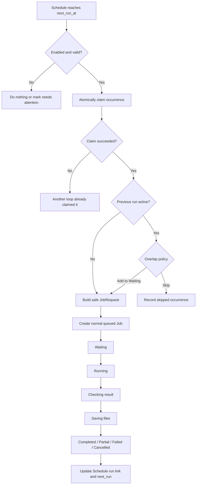

# Relay-agent GUI Development Plan v1.2

- **Repository:** `miter37/Relay-agent`
- **Document date:** 2026-07-23
- **Target command:** `relay --gui`
- **Primary platforms:** Windows 11 first, Linux and macOS supported after platform validation
- **UI language:** Simple English
- **Document language:** Korean, with proposed UI labels and messages written in English
- **Status:** Detailed implementation plan
- **Supersedes:** `Relay_GUI_Development_Plan_v1.0.md`

---

## 0. v1.2 revision summary

v1.2는 v1.0의 기본 방향을 유지하면서 다음을 명확히 고쳤다.

### 0.1 Product and UI changes

1. 사이드바의 종료 작업 메뉴명을 `Completed`에서 **`Finished`**로 변경했다.
   - 종료 목록에는 `Completed`, `Partial`, `Failed`, `Cancelled`가 모두 포함된다.
   - 실패 작업까지 포함하는 메뉴를 `Completed`라고 부르는 것은 의미가 맞지 않는다.
   - 한국어 요구사항의 “완료된 작업”은 UI에서 더 정확하고 쉬운 영어인 `Finished`로 표현한다.

2. Schedule은 **성공한 기존 작업에서만 생성**한다.
   - `Schedule this task` 버튼을 누른 뒤 반복 주기와 시각만 선택한다.
   - 새 작업 등록 화면에서 Schedule을 동시에 만드는 흐름은 MVP에서 제외한다.

3. Schedule 실행분도 일반 Job으로 생성되어 반드시 다음 흐름을 탄다.

```text
Waiting → Running → Finished
```

4. CLI, Hermes, GUI, Schedule이 만든 작업을 모두 같은 화면에서 보여준다.

5. Finished 검색은 서버 측 검색·필터·페이지네이션을 사용한다.

### 0.2 Core architecture changes

1. GUI는 SQLite를 직접 수정하지 않는다.
2. 새 API는 `/v1/...` 아래에 추가하고 기존 daemon endpoint는 유지한다.
3. DB migration은 `PRAGMA user_version`과 transaction을 사용한다.
4. Schedule due 처리에는 atomic claim과 unique occurrence key를 사용한다.
5. Schedule 시각은 rule의 timezone과 UTC `next_run_at`을 함께 저장한다.
6. `caller`와 `submitted_via`를 분리한다.
   - `caller`: 보안 정책을 위한 실행 주체
   - `submitted_via`: CLI, GUI, Hermes, Schedule과 같은 표시 출처
7. Schedule은 무인 실행이므로 기존 service isolation 보안 규칙을 적용한다.
8. Schedule이 원본 작업의 외부 output path, workspace, request ID를 그대로 상속하지 않도록 한다.

### 0.3 Privacy and replay changes

현재 Relay의 재실행 기능은 원본 요청을 다시 만들 수 있어야 한다. 따라서 단순히 `history_mode=metadata`라고 부르면서 실제 요청 내용을 저장하는 구조는 의미가 불명확하다.

v1.2에서는 다음을 분리한다.

- `history_display_mode`: GUI에서 작업 내용을 보여줄지
- `store_replayable_requests`: 재실행·Schedule 생성을 위해 요청 snapshot을 저장할지

`store_replayable_requests=false`인 작업은:

- 결과와 metadata는 볼 수 있음
- `Run again` 비활성
- `Schedule this task` 비활성
- 원본 task text는 저장하지 않음

### 0.4 Development order changes

Dynamic Agent Registry를 GUI 시작 전에 한 번에 전면 교체하지 않는다.

1. 먼저 기존 built-in Agent를 감싸는 registry interface만 추가한다.
2. GUI와 Schedule을 안정화한다.
3. 마지막에 `GenericCLIAdapter`와 사용자 Agent App 등록을 활성화한다.

이 순서는 기존 CLI 회귀 위험을 줄인다.

---

## 1. Purpose

Relay-agent의 기존 CLI 기능을 유지하면서, 사람이 다음 작업을 편리하게 수행할 수 있는 로컬 데스크톱 GUI를 추가한다.

- 작업 등록
- 대기·진행·종료 상태 확인
- 결과·로그·산출물 확인
- 기존 성공 작업을 반복 일정으로 등록
- Schedule의 다음 실행 시각과 실행 기록 확인
- Agent 상태와 model 확인
- 신규 Agent App 등록
- 설정과 cleanup 관리

GUI는 별도 실행 엔진이 아니다. 기존 Relay의 다음 요소를 공유하는 **visual control client**다.

- `RelayEngine`
- local daemon
- SQLite job history
- worker adapters
- validation
- atomic delivery
- cleanup policy
- configuration
- capability audit / deep doctor

---

## 2. Product definition

`relay --gui`를 실행하면 Relay 데스크톱 앱이 열린다.

앱의 중심 구조는 다음 두 영역이다.

1. **Sidebar**
   - Waiting
   - Running
   - Finished
   - Schedules
   - Settings

2. **Main panel**
   - 선택한 Job 상세
   - 선택한 Schedule 상세
   - New Task 화면
   - Settings 화면
   - Agent App 등록 wizard

GUI를 닫아도 daemon이 살아 있다면 다음은 계속 동작한다.

- 이미 실행 중인 작업
- Waiting 작업
- Schedule due check
- cleanup maintenance

---

## 3. Scope and non-goals

### 3.1 In scope

- `relay --gui`
- shared CLI/GUI/Hermes/Schedule history
- job creation and monitoring
- result, logs, files, events
- Schedule creation from a successful Job
- Daily, Weekly, Monthly, Every N days, One time
- multiple times per day
- timezone-aware next-run calculation
- Schedule pause, resume, edit, run now, delete
- custom Agent App registration
- cross-platform desktop packaging
- Simple English UI

### 3.2 Out of scope for GUI v1.0

- multi-user accounts
- remote team collaboration
- cloud synchronization
- browser-hosted public web UI
- mobile UI
- DAG or dependent task workflow
- automatic factual evaluation of AI output
- arbitrary shell script execution
- webhook-triggered jobs
- second-level scheduling
- more frequent than one minute Schedule execution
- automatically cancelling the previous run when a new Schedule occurrence arrives

---

## 4. Fixed product principles

### 4.1 One Relay home, one shared history

다음 모든 실행 경로는 동일한 Relay home과 SQLite를 사용한다.

```text
CLI
Hermes
GUI
Schedule engine
```

```text
                         ┌──────────────────┐
CLI ────────────────────▶│                  │
Hermes ─────────────────▶│   Relay daemon   │
GUI ────────────────────▶│   + RelayEngine  │
Schedule engine ─────────▶│                  │
                         └────────┬─────────┘
                                  │
                                  ▼
                           SQLite job history
                                  │
                                  ▼
                        GUI sidebar and details
```

GUI용 별도 Job DB를 만들지 않는다.

### 4.2 CLI jobs must appear in the GUI

CLI에서 다음과 같이 실행한 작업도 GUI에 나타난다.

```text
relay "Research today's semiconductor news"
relay run --task-file task.md
relay submit --task-file task.md
```

같은 `RELAY_HOME`을 사용하는 한 다음 상태 변화가 GUI에 반영된다.

```text
CLI creates job
    ↓
Waiting or Running
    ↓
Finished
```

### 4.3 GUI jobs must remain CLI-visible

GUI에서 만든 Job은 일반 `jobs` row로 기록된다.

다음 CLI 명령에서도 확인할 수 있어야 한다.

```text
relay history
relay show <job_id>
relay logs <job_id>
relay result <job_id>
relay cancel <job_id>
```

### 4.4 Schedules create normal Jobs

Schedule은 Agent를 직접 실행하지 않는다.

```text
Schedule Engine
      ↓
normal JobRequest
      ↓
Relay queue
      ↓
RelayEngine
      ↓
validation and delivery
```

Schedule 실행분도 일반 Job과 동일하게:

- 동시 실행 제한
- Agent 검증
- fallback
- timeout
- cancellation
- result validation
- atomic delivery
- logs
- artifacts
- cleanup

을 적용받는다.

### 4.5 Simple English

메뉴, 버튼, 설명, 오류 메시지는 가능한 한 쉬운 영어를 사용한다.

| Avoid | Use |
|---|---|
| Queue | Waiting |
| Terminal history | Finished |
| Cron Jobs | Schedules |
| Trigger | Run now |
| Recurrence | Repeat |
| Execute | Run |
| Terminate | Stop |
| Artifact directory | Files folder |
| Capability audit | Test agent |
| Invocation parameters | Command options |
| Submit request | Create task |

---

## 5. Recommended GUI technology

### 5.1 PySide6

GUI는 `PySide6` 기반으로 구현하는 것을 권장한다.

이유:

- Windows, Linux, macOS 지원
- native file dialog
- split panel과 resizable sidebar
- tree/list grouping
- tabs와 modal dialog
- system tray와 notification 확장 가능
- 대용량 로그 viewer 구현 가능
- high-DPI 지원
- Tkinter보다 복잡한 데스크톱 UI 구현에 적합

### 5.2 Optional dependency

headless CLI 설치를 무겁게 만들지 않는다.

```toml
[project.optional-dependencies]
gui = [
  "PySide6>=6.8,<7",
  "tzdata>=2025.2"
]
```

GUI dependency가 없을 때:

```text
GUI support is not installed.

Run:
pip install "relay-ai-cli-broker[gui]"
```

### 5.3 Packaging direction

개발 단계:

```text
python package + optional GUI dependency
```

배포 단계:

- Windows installer 또는 self-contained app
- macOS app bundle
- Linux package 또는 launcher
- headless installation은 계속 지원

PyInstaller, Nuitka 등 실제 packaging 방식은 Phase G6에서 작은 proof of concept 후 결정한다.

---

## 6. Main information architecture

```text
Relay-agent
│
├─ + New Task
│
├─ Waiting
│   └─ queued jobs
│
├─ Running
│   └─ active jobs
│
├─ Finished
│   ├─ Search
│   ├─ Filters
│   ├─ Today
│   ├─ Yesterday
│   └─ older dates
│
├─ Schedules
│   ├─ Active
│   ├─ Paused
│   └─ Needs attention
│
└─ Settings
    ├─ General
    ├─ Agents
    ├─ Agent Apps
    ├─ Paths
    ├─ Task rules
    ├─ Schedules
    ├─ Cleanup
    └─ Security
```

---

## 7. Main window layout

```text
┌────────────────────────────────────────────────────────────────────────────────┐
│ Relay-agent                             Daemon: Running        [ + New Task ]   │
├───────────────────────────┬────────────────────────────────────────────────────┤
│                           │                                                    │
│ ▾ Waiting              3  │                                                    │
│   Market news research    │                                                    │
│   Review report.pdf       │                                                    │
│   Check project code      │                                                    │
│                           │                                                    │
│ ▾ Running              1  │                                                    │
│   ● Semiconductor news    │                    Main panel                      │
│     Codex · 04:31         │                                                    │
│                           │      Selected job, schedule, or settings page      │
│ ▾ Finished                │                                                    │
│   [ Search jobs...     ]  │                                                    │
│   [ Result ▼ ] [ More ]   │                                                    │
│                           │                                                    │
│   ▾ Today              8  │                                                    │
│      ✓ TSMC analysis      │                                                    │
│      ◐ Market research    │                                                    │
│      × PDF extraction     │                                                    │
│   ▸ Yesterday         12  │                                                    │
│   ▸ Jul 21             9  │                                                    │
│                           │                                                    │
│ ▾ Schedules            4  │                                                    │
│   ● Daily market news     │                                                    │
│     Next: Today 13:00     │                                                    │
│   ● Weekly stock review   │                                                    │
│     Next: Fri 07:00       │                                                    │
│   ○ Monthly report        │                                                    │
│     Paused                │                                                    │
│                           │                                                    │
│ ⚙ Settings                │                                                    │
├───────────────────────────┴────────────────────────────────────────────────────┤
│ Claude: Ready | Codex: Ready | Antigravity: Off | Running: 1 of 2             │
│ Relay Home: C:\Users\name\AppData\Local\Relay                                 │
└────────────────────────────────────────────────────────────────────────────────┘
```

### 7.1 Layout rules

- default sidebar width: 320px
- minimum: 260px
- maximum: 480px
- drag resize
- window size and sidebar width persisted
- recommended minimum window: 1280×720
- native OS scaling
- one main scroll area per view
- sidebar and main panel scroll independently

### 7.2 Refresh rules

MVP:

- active job list: poll every 1 second
- finished list count: poll every 3 seconds
- Schedule next-run status: poll every 15 seconds
- logs: tail every 1 second only while Logs tab is visible
- pause polling when app is minimized, except low-frequency health check

추후 local event stream을 추가할 수 있지만 MVP에서는 polling을 사용한다.

---

## 8. Sidebar behavior

## 8.1 Waiting

포함 상태:

- `CREATED`
- `QUEUED`

`PREPARING`부터는 Running으로 이동한다.

표시:

```text
Market news research
Codex first · Added 08:32
```

Schedule 실행분:

```text
Daily market news
Scheduled · Added 13:00
```

선택 시 main panel:

- Task
- Files
- Agent
- Model
- Profile
- Fallback
- Result type
- Time limit
- Output destination
- Created time
- Source
- Schedule name, if applicable

지원 동작:

```text
[ Edit ] [ Stop ] [ Copy job ID ]
```

`Edit`는 아직 `QUEUED`이고 실행 lease가 없는 작업에만 허용한다.

### Waiting edit safety

Job 수정은 단순 DB update가 아니다.

서버는 다음을 atomically 확인한다.

1. status is `QUEUED`
2. scheduler가 아직 claim하지 않음
3. request hash와 paths를 다시 계산
4. validation 재실행
5. event 기록

MVP에서 안전하게 구현하기 어렵다면 `Edit`을 제외하고 다음만 지원해도 된다.

```text
[ Stop ] [ Copy settings to a new task ]
```

v1.2 권장 기본은 **queued Job 직접 수정 제외**다.

---

## 8.2 Running

포함 상태:

- `PREPARING`
- `RUNNING`
- `VALIDATING`
- `DELIVERING`
- `CANCEL_REQUESTED`

표시:

```text
● Semiconductor news
Codex · Running · 04:31
```

percentage는 표시하지 않는다.

```text
Prepare → Run → Check result → Save files → Done
          ━━━
```

| Internal | UI |
|---|---|
| PREPARING | Preparing |
| RUNNING | Running |
| VALIDATING | Checking result |
| DELIVERING | Saving files |
| CANCEL_REQUESTED | Stopping |

Actions:

```text
[ Stop task ] [ Show live log ]
```

---

## 8.3 Finished

포함 상태:

- `COMPLETED`
- `PARTIAL`
- `FAILED`
- `CANCELLED`

상태 표시:

| Status | Icon | UI label |
|---|---:|---|
| COMPLETED | ✓ | Completed |
| PARTIAL | ◐ | Partial |
| FAILED | × | Failed |
| CANCELLED | — | Cancelled |

날짜 grouping은 `completed_at`을 기준으로 한다.

```text
▾ Today · 8
   ✓ TSMC analysis             08:20
   ◐ Data center research      07:43
   × PDF chart extraction      06:15

▸ Yesterday · 12
▸ Jul 21, 2026 · 9
▸ Jul 20, 2026 · 4
```

기본 규칙:

- Today: open
- Yesterday and older: closed
- recent dates first
- newest item first inside each date
- GUI local timezone 기준
- initial load: 50 terminal Jobs
- `Load more` or cursor pagination
- empty date groups hidden
- group open/closed state persisted for current app session

---

## 8.4 Finished search and filters

```text
Finished
[ Search finished jobs...                ]
[ Result ▼ ] [ Agent ▼ ] [ Source ▼ ] [ Date ▼ ]
```

### Search fields

- display title
- stored task preview
- job ID
- Agent ID and display name
- model
- profile
- error code
- Schedule name
- attachment filename, if snapshot metadata exists

### Filters

```text
Result
- All
- Completed
- Partial
- Failed
- Cancelled
```

```text
Agent
- All agents
- Claude
- Codex
- Antigravity
- custom agents
```

```text
Source
- All sources
- Command line
- GUI
- Hermes
- Schedule
```

```text
Date
- Any time
- Today
- Last 7 days
- Last 30 days
- Custom range
```

### Search implementation

- server-side
- debounce: 300ms
- cursor pagination
- result limit enforced
- date grouping retained
- matching date groups only
- case-insensitive where SQLite permits
- Korean and English text supported
- wildcard input escaped
- raw SQL fragment input prohibited

---

## 8.5 Schedules

표시:

```text
▾ Schedules · 4

   ● Daily market news
     Next: Today 13:00

   ● Weekly stock review
     Next: Fri 07:00

   ○ Monthly report
     Paused

   × Data collection
     Needs attention
```

| Icon | Meaning |
|---:|---|
| ● | Active |
| ○ | Paused |
| × | Needs attention |

`Last run failed`만으로 Schedule 자체를 error 상태로 만들지는 않는다.

`Needs attention` 조건:

- request snapshot missing
- attachment snapshot missing
- Agent removed
- Schedule rule invalid
- timezone invalid
- repeated queue creation failure
- service isolation not acknowledged
- auto-start unavailable and daemon stopped frequently, optional warning

---

## 9. Main panel: Job details

```text
Market news research                                        Completed

Codex · gpt-5.x · web-research
Created 08:31 · Started 08:32 · Finished 08:40
Source: Command line

[ Overview ] [ Task ] [ Progress ] [ Result ] [ Files ] [ Logs ] [ Events ]
```

기본 tab:

| State | Default |
|---|---|
| Waiting | Task |
| Running | Progress |
| Completed | Result |
| Partial | Result |
| Failed | Logs |
| Cancelled | Overview |

---

## 9.1 Overview

```text
Status                 Completed
Requested agent        Claude
Actual agent           Codex
Model                  gpt-5.x
Profile                web-research
Result type            JSON
Fallback               On
Created                Jul 23, 2026 08:31
Started                Jul 23, 2026 08:32
Finished               Jul 23, 2026 08:40
Result file            C:\...\result.json
Files folder           C:\...\artifacts
Source                 Command line
```

Fallback:

```text
Claude
  └─ Sign-in required
       ↓
Codex
  └─ Completed
```

Actions:

```text
[ Run again ] [ Copy settings ] [ Open result ] [ Open folder ]
```

완전 성공이며 replay snapshot이 존재할 때:

```text
[ Schedule this task ]
```

### Action availability

| Action | Condition |
|---|---|
| Run again | replay snapshot exists |
| Schedule this task | status COMPLETED + replay snapshot exists |
| Open result | file exists |
| Open folder | folder exists |
| Stop task | active state |
| Copy settings | replay snapshot or visible sanitized request exists |

---

## 9.2 Task

표시 가능한 경우:

- display title
- original task text
- task file source, informational
- attachments
- requested Agent
- model
- profile
- fallback
- time limit
- caller
- request ID
- workspace policy
- output policy

### Historical title generation

1. explicit title
2. first non-empty task line
3. maximum 60 visible characters
4. otherwise `Job <short-id>`

### History privacy display

`history_display_mode=metadata`이면:

```text
Task details are hidden by your history settings.
```

단, replay snapshot이 내부에 저장되어 있을 수 있다는 점은 Settings에서 정확히 설명해야 한다.

---

## 9.3 Progress

```text
Current step

Prepare        Done
Run            In progress
Check result   Waiting
Save files     Waiting
Done           Waiting
```

Attempts:

```text
Attempt 1
Agent          Claude
Result         Failed
Reason         Sign-in required

Attempt 2
Agent          Codex
Result         Running
Elapsed        04:31
```

---

## 9.4 Result

JSON:

```text
Answer
────────────────────────────────────────
The main findings are...

Sources · 8
Uncertainties · 2
Missing items · 0

[ Show sources ] [ Show raw JSON ] [ Open result ]
```

TXT:

- readable text view
- word wrap
- copy all
- open external

Notice:

```text
Relay checked the file format and delivery.
It did not check whether the answer is factually correct.
```

---

## 9.5 Files

```text
Name                     Type        Size       Actions
market_report.html       HTML        420 KB     Open · Show in folder
chart.png                Image       860 KB     Preview · Open
source_data.csv          CSV          72 KB     Open · Show in folder
```

Internal preview:

- PNG/JPEG/WebP
- TXT/JSON/CSV/MD with strict size limit

External open:

- HTML
- PDF
- spreadsheet
- unknown types

Path display is read-only and selectable.

---

## 9.6 Logs

```text
[ Attempt 1: Claude ▼ ] [ stdout ] [ stderr ] [ Errors only ]

08:32:01 ...
08:32:03 ...
```

Rules:

- tail only
- initial tail: last 8,000–20,000 characters
- incremental read by file offset
- no full-file reload
- auto-scroll toggle
- search current loaded portion
- copy selection
- open full log file
- log path access validation before opening

---

## 9.7 Events

```text
08:31:58  Job created
08:32:00  Preparing
08:32:02  Claude started
08:32:14  Claude failed: Sign-in required
08:32:15  Codex started
08:39:52  Checking result
08:40:01  Saving files
08:40:03  Completed
```

internal event code는 유지하고 UI formatter에서 쉬운 영어로 변환한다.

---

## 10. New Task screen

```text
New Task

[ Task ] [ Agent ] [ Run options ] [ Output ] [ Advanced ]
```

Schedule은 이 화면에서 직접 만들지 않는다.

---

## 10.1 Task

```text
Task name
[ Research today's AI semiconductor news                    ]

What should the agent do?
┌────────────────────────────────────────────────────────────┐
│ Research the last 24 hours of AI semiconductor news...    │
│                                                            │
└────────────────────────────────────────────────────────────┘

Task input
(●) Write here
( ) Use a task file

Files
[ + Add files ]   report.pdf   data.xlsx

Profile
[ web-research ▼ ]
```

Rules:

- task name optional
- blank name auto-generated
- drag-and-drop attachments
- duplicate filename warning
- missing attachment blocked before create
- task file is read and materialized before Job creation

---

## 10.2 Agent

```text
Agent
[ Codex ▼ ]

Model
[ Default model ▼ ]                         [ Refresh ]

Use another agent if this fails
[✓]

Try in this order
1. Claude
2. Antigravity
[ Change order ]
```

작업별 fallback:

```python
fallback_agents: list[str] | None
```

- `None`: global order
- explicit list: Job-specific order

field 이름은 기존 `worker` 호환성을 위해 내부 migration 동안 `worker`를 유지할 수 있다. UI에서는 `Agent`를 사용한다.

---

## 10.3 Run options

```text
Run in the background
[✓]

Time limit
[ 1200 ] seconds

Workspace
[ Use the default workspace ▼ ]

Create a new job even if the same task exists
[ ]

Replace an existing result file
[ ]
```

GUI에서는 daemon background submit만 실제 실행 경로로 사용한다.

`Run in the background`는 항상 on으로 두고 설명만 제공하거나, UI에서 제거해도 된다.

GUI process가 synchronous `RelayEngine.run()`을 직접 호출하지 않는다.

---

## 10.4 Output

```text
Result type
[ JSON ▼ ]

Result file
(●) Choose automatically
( ) Use this path  [____________________] [ Browse ]

Files folder
(●) Choose automatically
( ) Use this path  [____________________] [ Browse ]
```

자동 path 예시:

```text
C:\Users\name\AppData\Local\Relay\results\2026-07-23\<job-id>\result.json
```

---

## 10.5 Advanced

```text
Request ID
[ Create automatically __________________ ]

Caller
[ Human ▼ ]

Model name
[ _______________________________________ ]

[ ] Force a new job
[ ] Replace existing output
```

`submitted_via`는 사용자가 고르는 값이 아니다.

GUI server가 자동으로:

```text
submitted_via = gui
```

를 설정한다.

`caller`는 security principal이고 기본값은 `human`이다.

---

## 10.6 Bottom action bar

```text
[ Show CLI command ] [ Save as template ] [ Clear ] [ Create task ]
```

CLI preview는 실제 서버 payload와 가능한 한 동일하게 만든다.

Windows:

```powershell
relay submit `
  --task-file "C:\...\request.md" `
  --worker codex `
  --model "gpt-5.x" `
  --format json `
  --timeout 1200 `
  --attach "C:\...\report.pdf"
```

Linux/macOS:

```sh
relay submit \
  --task-file "/home/.../request.md" \
  --worker codex \
  --model "gpt-5.x" \
  --format json \
  --timeout 1200 \
  --attach "/home/.../report.pdf"
```

---

## 11. Schedule creation

## 11.1 Eligibility

`Schedule this task` 조건:

1. Job status is `COMPLETED`
2. internal result status is `complete`
3. replay snapshot exists
4. task text can be materialized
5. all attachments can be copied
6. Agent definition still exists
7. service isolation is acknowledged
8. source Job is not already being deleted

조건이 충족되지 않으면 이유를 알려준다.

```text
This task cannot be scheduled.

The original request was not saved.
Run the task again with “Save task settings” turned on.
```

---

## 11.2 Dialog

```text
┌───────────────────────────────────────────────────────────────┐
│ Schedule this task                                            │
├───────────────────────────────────────────────────────────────┤
│ Task                                                          │
│ Daily market news                                             │
│ Codex · Default model · web-research                          │
│                                                               │
│ Schedule name                                                 │
│ [ Daily market news_______________________________________ ]  │
│                                                               │
│ Repeat                                                        │
│ [ Daily ▼ ]                                                   │
│                                                               │
│ Time                                                          │
│ [ 09:00 ] [ × ]                                               │
│ [ 13:00 ] [ × ]                                               │
│ [ + Add another time ]                                        │
│                                                               │
│ Time zone                                                     │
│ [ Asia/Seoul ▼ ]                                              │
│                                                               │
│ Next runs                                                     │
│ • Jul 24, 2026 09:00                                          │
│ • Jul 24, 2026 13:00                                          │
│ • Jul 25, 2026 09:00                                          │
│ • Jul 25, 2026 13:00                                          │
│ • Jul 26, 2026 09:00                                          │
│                                                               │
│ [ More options ]                [ Cancel ] [ Create schedule ] │
└───────────────────────────────────────────────────────────────┘
```

Popup은 schedule rule 선택에 집중한다.

원본 Job에서 안전하게 상속:

- task
- title
- Agent
- model
- profile
- result format
- fallback settings
- timeout
- safe Agent options

강제로 변경:

```text
request_id       → clear
force_new        → true
output_path      → automatic
artifact_path    → automatic
workspace        → default managed workspace
task_file        → materialized task snapshot
caller           → schedule
submitted_via    → schedule
```

외부 output path와 외부 workspace는 Schedule에 상속하지 않는다.

---

## 12. Supported Schedule types

## 12.1 Daily

```text
Repeat
Daily

Times
09:00
13:00
18:30
```

```json
{
  "type": "daily",
  "times": ["09:00", "13:00", "18:30"],
  "timezone": "Asia/Seoul"
}
```

---

## 12.2 Weekly

```text
Repeat
Weekly

Days
[✓ Mon] [ ] Tue [✓ Wed] [ ] Thu [✓ Fri] [ ] Sat [ ] Sun

Times
07:00
18:00
```

```json
{
  "type": "weekly",
  "weekdays": [1, 3, 5],
  "times": ["07:00", "18:00"],
  "timezone": "Asia/Seoul"
}
```

ISO Monday=1.

---

## 12.3 Monthly

```text
Repeat
Monthly

Dates
[ 1 ] [ 15 ] [ 28 ] [ + Add date ]

Times
09:00
```

```json
{
  "type": "monthly",
  "month_days": [1, 15, 28],
  "times": ["09:00"],
  "missing_day_policy": "skip",
  "timezone": "Asia/Seoul"
}
```

기본:

```text
Skip months that do not have this date.
```

Optional:

```text
Use the last day of the month instead.
```

---

## 12.4 Every N days

```text
Repeat
Every [ 3 ] days

Start date
[ Jul 23, 2026 ]

Times
09:00
18:00
```

```json
{
  "type": "n_days",
  "interval_days": 3,
  "anchor_date": "2026-07-23",
  "times": ["09:00", "18:00"],
  "timezone": "Asia/Seoul"
}
```

---

## 12.5 One time

```text
Repeat
One time

Date
[ Aug 3, 2026 ]

Time
[ 10:30 ]
```

```json
{
  "type": "once",
  "run_at_local": "2026-08-03T10:30:00",
  "timezone": "Asia/Seoul"
}
```

실행 occurrence를 성공적으로 queue한 뒤 Schedule을 inactive로 전환한다.

---

## 13. Schedule advanced options

## 13.1 Previous run is active

```text
If the previous run is still active

(●) Skip this run
( ) Add this run to Waiting
```

기본값:

```text
Skip this run
```

active 판단에는 같은 Schedule의 다음 상태를 포함한다.

- QUEUED
- PREPARING
- RUNNING
- VALIDATING
- DELIVERING
- CANCEL_REQUESTED

---

## 13.2 Relay was not running

```text
If Relay was not running

(●) Skip missed runs
( ) Run once when Relay starts
```

`Run once when Relay starts`는 backlog 전체를 실행하지 않는다.

- 가장 최근 missed occurrence 하나만 생성
- grace period 내 occurrence만 허용
- default grace period: 12 hours
- manual `Run now`와 구분하여 `trigger_type=catch_up`

---

## 13.3 Start and end

```text
Start
[ Now ▼ ]

End
(●) No end date
( ) End on [ date ]
```

---

## 13.4 Next-run preview

저장 전 다음 5회를 표시한다.

```text
Next runs
• Jul 24, 2026 09:00
• Jul 24, 2026 13:00
• Jul 25, 2026 09:00
• Jul 25, 2026 13:00
• Jul 26, 2026 09:00
```

preview 계산과 daemon 실행 계산은 같은 함수와 같은 rule parser를 사용한다.

---

## 14. Timezone and clock rules

### 14.1 Storage

저장:

- canonical local rule
- IANA timezone
- `next_run_at_utc`
- `last_occurrence_key`

표시:

- Schedule timezone 기준
- GUI local time을 보조로 표시 가능

```text
Next run
Jul 24, 2026 09:00 Asia/Seoul
```

### 14.2 DST nonexistent time

예: DST 시작으로 02:30이 존재하지 않을 때.

기본 정책:

```text
Skip this occurrence.
```

### 14.3 DST ambiguous time

같은 local time이 두 번 나타나는 경우.

기본 정책:

```text
Run once at the first occurrence.
```

occurrence key에는 UTC instant를 포함해 중복 실행을 방지한다.

### 14.4 Clock changes

- wall-clock time은 timezone-aware datetime으로 계산
- scheduler loop interval은 monotonic waiting 사용
- 시스템 시간이 크게 바뀌면 next run 재계산
- daemon start 시 모든 active Schedule의 `next_run_at_utc` 검증

---

## 15. Schedule detail screen

```text
Daily market news                                       Active

Daily at 09:00 and 13:00
Time zone: Asia/Seoul

Next run
Jul 24, 2026 09:00

Last run
Jul 23, 2026 13:00 · Completed

[ Overview ] [ Task settings ] [ Run history ]
```

### 15.1 Overview

```text
Repeat               Daily
Times                09:00, 13:00
Time zone            Asia/Seoul
Next run             Jul 24, 2026 09:00
Last run             Jul 23, 2026 13:00
Previous run active  Skip
Missed runs          Skip
Created from         Job abc123
```

Actions:

```text
[ Run now ] [ Pause ] [ Edit schedule ] [ Copy ] [ Delete ]
```

### 15.2 Task settings

```text
Task name            Daily market news
Agent                Codex
Model                Default model
Profile              web-research
Fallback             Claude
Time limit           20 minutes
Result type          JSON
Input snapshot       Ready
```

### 15.3 Run history

```text
Planned                  Started                 Result
Jul 23, 13:00            Jul 23, 13:00           Completed
Jul 23, 09:00            Jul 23, 09:00           Completed
Jul 22, 13:00            Jul 22, 13:01           Failed
Jul 22, 09:00            —                       Skipped
```

row 클릭 시 일반 Job detail로 이동한다.

---

## 16. Schedule runtime lifecycle



### 16.1 Atomic claim

단순히 `next_run_at <= now`를 읽고 Job을 생성하면 scheduler thread 중복, daemon restart, 두 daemon instance에서 중복 실행될 수 있다.

필수 조건:

- `occurrence_key` unique
- transaction 안에서 planned row insert
- insert 성공한 process만 Job 생성
- Job 생성 실패 시 schedule run state와 retryable error 기록
- Job 생성 후 `job_id` 연결

---

## 17. Attachment and request snapshot

Schedule은 원본 path를 장기간 참조하지 않는다.

```text
source Job replay snapshot
    ↓
materialize request text
    ↓
copy attachments
    ↓
<RELAY_HOME>/schedule-inputs/<schedule_id>/
```

```text
schedule-inputs/
└─ sch_abc123/
   ├─ request.md
   ├─ attachments.json
   ├─ report.pdf
   └─ data.xlsx
```

### 17.1 Creation checks

Schedule 생성 전:

- task snapshot exists
- attachment source exists
- total size within configured limit
- destination under schedule input root
- no symlink escape
- filenames normalized
- copies hashed
- manifest written atomically

### 17.2 Deletion

```text
Delete this schedule?

Past job results will not be deleted.
The saved task files for this schedule will be removed later.
```

- past Jobs remain
- Schedule definition soft-deleted or removed
- input snapshot marked for cleanup
- active occurrence가 있으면 Schedule 삭제는 future runs만 막음
- 이미 생성된 normal Job은 자동 취소하지 않음

---

## 18. Replayable request and privacy model

### 18.1 Problem

`Run again`과 `Schedule this task`는 원본 task와 options가 필요하다.

따라서 task를 저장하지 않으면서 완전한 재실행을 제공할 수는 없다.

### 18.2 Settings

```text
Save task settings for Run again and Schedules
[✓]

Show task text in history
[✓]
```

internal:

```toml
store_replayable_requests = true
history_display_mode = "full"
```

### 18.3 Behavior matrix

| Save replay request | Show text | Run again | Schedule | Task tab |
|---|---|---|---|---|
| true | full | Yes | Yes after success | Full |
| true | metadata | Yes | Yes after success | Hidden |
| false | full | No after process ends | No | only transient |
| false | metadata | No | No | metadata only |

### 18.4 Sensitive data notice

Settings에 쉬운 영어로 표시한다.

```text
Relay can save the task text and file paths so you can run the task again.

Turn this off if task requests may contain sensitive information.
```

민감정보 저장은 local-only라고 하더라도 명확히 설명해야 한다.

---

## 19. Source and security identity

`caller`와 `submitted_via`를 혼용하지 않는다.

### 19.1 caller

보안 정책:

- `human`
- `hermes`
- `service`
- `schedule`

### 19.2 submitted_via

UI 표시와 통계:

- `cli`
- `gui`
- `hermes`
- `schedule`
- `legacy`

### 19.3 Server assignment

- GUI endpoint: server sets `submitted_via=gui`
- CLI: CLI sets `submitted_via=cli`
- Hermes caller: server normalizes to `hermes`
- Schedule engine: server sets `caller=schedule`, `submitted_via=schedule`
- clients cannot forge `schedule_id` link through public Job creation API

Schedule은 무인 실행이므로 `service_isolation_acknowledged=true`가 필요하다.

---

## 20. GUI and daemon communication

```text
GUI
 │
 │ token-authenticated loopback RPC
 ▼
Relay daemon
 │
 ├─ Job API
 ├─ Schedule API
 ├─ Agent API
 ├─ Config API
 └─ Cleanup API
 │
 ▼
SQLite + RelayEngine
```

GUI는 SQLite를 직접 수정하지 않는다.

read-only direct DB access도 MVP에서는 사용하지 않는다. 모든 데이터는 daemon schema를 통해 받는다.

---

## 21. API versioning

기존 endpoint 호환성을 유지한다.

현재 endpoint 예:

```text
/submit
/status/<job_id>
/result/<job_id>
/show/<job_id>
/cancel/<job_id>
```

새 GUI API:

```text
/v1/jobs
/v1/schedules
/v1/agents
/v1/config
/v1/cleanup
```

### 21.1 Jobs

```http
GET    /v1/jobs
GET    /v1/jobs/{job_id}
POST   /v1/jobs
POST   /v1/jobs/{job_id}/cancel
POST   /v1/jobs/{job_id}/rerun
GET    /v1/jobs/{job_id}/logs
GET    /v1/jobs/{job_id}/events
GET    /v1/jobs/{job_id}/artifacts
```

queued Job edit은 MVP에서 제외한다.

### 21.2 Schedules

```http
GET    /v1/schedules
POST   /v1/schedules/from-job/{job_id}
GET    /v1/schedules/{schedule_id}
PATCH  /v1/schedules/{schedule_id}
DELETE /v1/schedules/{schedule_id}

POST   /v1/schedules/{schedule_id}/run-now
POST   /v1/schedules/{schedule_id}/pause
POST   /v1/schedules/{schedule_id}/resume

GET    /v1/schedules/{schedule_id}/runs
POST   /v1/schedules/preview
```

### 21.3 Agents

```http
GET    /v1/agents
GET    /v1/agents/{agent_id}
POST   /v1/agents
PATCH  /v1/agents/{agent_id}
DELETE /v1/agents/{agent_id}

POST   /v1/agents/{agent_id}/test
GET    /v1/agents/{agent_id}/models
POST   /v1/agents/{agent_id}/models/refresh
```

### 21.4 Config

```http
GET    /v1/config
PATCH  /v1/config
GET    /v1/cleanup/status
POST   /v1/cleanup
GET    /health
POST   /shutdown
```

### 21.5 Error response

```json
{
  "ok": false,
  "error_code": "SCHEDULE_INPUT_MISSING",
  "message": "A saved input file is missing.",
  "action": "Open the schedule and add the file again.",
  "details": {}
}
```

UI에는 `message`와 `action`을 보여주고 code는 Technical details에 둔다.

---

## 22. Database migration

### 22.1 Migration framework

현재 단순 `CREATE TABLE IF NOT EXISTS`를 유지하되 versioned migration을 추가한다.

```text
PRAGMA user_version
```

규칙:

- migration transaction
- migration 전 DB backup
- migration failure 시 startup 중단
- 기존 DB를 삭제하거나 새 DB로 silently 교체하지 않음
- migration unit test
- downgrade는 지원하지 않되 backup 복구 안내

### 22.2 Jobs additions

```sql
ALTER TABLE jobs ADD COLUMN title TEXT;
ALTER TABLE jobs ADD COLUMN submitted_via TEXT;
ALTER TABLE jobs ADD COLUMN schedule_id TEXT;
ALTER TABLE jobs ADD COLUMN scheduled_for TEXT;
ALTER TABLE jobs ADD COLUMN task_preview TEXT;
ALTER TABLE jobs ADD COLUMN replayable INTEGER NOT NULL DEFAULT 1;
```

indexes:

```sql
CREATE INDEX IF NOT EXISTS idx_jobs_completed_at
ON jobs(completed_at);

CREATE INDEX IF NOT EXISTS idx_jobs_submitted_via
ON jobs(submitted_via);

CREATE INDEX IF NOT EXISTS idx_jobs_schedule
ON jobs(schedule_id, created_at);
```

### 22.3 Schedules

```sql
CREATE TABLE IF NOT EXISTS schedules (
    schedule_id TEXT PRIMARY KEY,
    name TEXT NOT NULL,
    enabled INTEGER NOT NULL DEFAULT 1,
    needs_attention INTEGER NOT NULL DEFAULT 0,

    schedule_type TEXT NOT NULL,
    schedule_json TEXT NOT NULL,
    timezone TEXT NOT NULL,

    source_job_id TEXT,
    request_template_json TEXT NOT NULL,
    input_snapshot_path TEXT,

    overlap_policy TEXT NOT NULL DEFAULT 'skip',
    missed_run_policy TEXT NOT NULL DEFAULT 'skip',
    catch_up_grace_minutes INTEGER NOT NULL DEFAULT 720,

    next_run_at_utc TEXT,
    last_occurrence_key TEXT,

    last_scheduled_at TEXT,
    last_started_at TEXT,
    last_completed_at TEXT,
    last_job_id TEXT,
    last_status TEXT,
    last_error_code TEXT,
    last_error_message TEXT,

    created_at TEXT NOT NULL,
    updated_at TEXT NOT NULL
);
```

### 22.4 Schedule runs

```sql
CREATE TABLE IF NOT EXISTS schedule_runs (
    schedule_run_id INTEGER PRIMARY KEY AUTOINCREMENT,
    schedule_id TEXT NOT NULL
        REFERENCES schedules(schedule_id) ON DELETE CASCADE,

    occurrence_key TEXT NOT NULL,
    scheduled_for_utc TEXT NOT NULL,
    scheduled_for_local TEXT NOT NULL,
    trigger_type TEXT NOT NULL,

    claimed_at TEXT,
    triggered_at TEXT,
    job_id TEXT,
    state TEXT NOT NULL,
    reason TEXT,

    created_at TEXT NOT NULL,
    updated_at TEXT NOT NULL
);

CREATE UNIQUE INDEX IF NOT EXISTS idx_schedule_occurrence_unique
ON schedule_runs(schedule_id, occurrence_key);

CREATE INDEX IF NOT EXISTS idx_schedule_runs_schedule
ON schedule_runs(schedule_id, scheduled_for_utc DESC);
```

`trigger_type`:

- `scheduled`
- `manual`
- `catch_up`

`state`:

- `claimed`
- `queued`
- `running`
- `completed`
- `partial`
- `failed`
- `cancelled`
- `skipped`
- `missed`

---

## 23. Schedule calculation engine

canonical JSON이 source of truth다. raw cron string은 사용하지 않는다.

Core:

```python
def validate_rule(rule: dict) -> None: ...

def next_occurrence(
    rule: dict,
    after_utc: datetime,
) -> ScheduledOccurrence | None: ...

def next_occurrences(
    rule: dict,
    after_utc: datetime,
    count: int,
) -> list[ScheduledOccurrence]: ...

def occurrence_key(
    schedule_id: str,
    scheduled_for_utc: datetime,
) -> str: ...
```

`ScheduledOccurrence`:

```python
@dataclass(frozen=True)
class ScheduledOccurrence:
    local_datetime: datetime
    utc_datetime: datetime
    occurrence_key: str
```

Schedule preview API와 daemon loop는 같은 code path를 사용한다.

---

## 24. Daemon scheduling loop

```text
Job queue loop       every 0.5 seconds
Schedule due check   every 15 seconds
Maintenance loop     hourly
```

Due process:

1. read due active schedules
2. calculate due occurrence
3. atomically insert unique schedule_run
4. evaluate overlap
5. build safe JobRequest
6. queue normal Job
7. link Job ID
8. calculate and persist next occurrence

### 24.1 Single daemon protection

daemon pid file만 신뢰하지 않는다.

- port bind remains primary single-instance guard
- token-authenticated health check
- stale pid cleanup
- unique schedule occurrence remains final duplicate protection

---

## 25. Auto-start

Schedule의 신뢰성을 위해 daemon auto-start가 필요하다.

첫 Schedule 생성 시:

```text
Relay must keep running to start scheduled tasks.

Start Relay automatically when you sign in?

[ Not now ] [ Turn on auto-start ]
```

Platforms:

- Windows: Task Scheduler, current user logon
- macOS: LaunchAgent
- Linux: systemd user service
- fallback: manual daemon start

Settings:

```text
Start Relay when I sign in
[✓]
```

daemon stop:

```text
Stopping Relay will also stop scheduled tasks.

[ Cancel ] [ Stop Relay ]
```

### Platform support status

- Windows: v1.0 release requirement
- Linux: release requirement after target-machine validation
- macOS: release requirement after target-machine validation

“implemented”와 “field validated”를 문서와 UI에서 구분한다.

---

## 26. Agent App registration

Settings:

```text
Settings
├─ General
├─ Agents
├─ Agent Apps
├─ Paths
├─ Task rules
├─ Schedules
├─ Cleanup
└─ Security
```

Agent Apps:

```text
Agent Apps

Built in
Claude Code       Ready
Codex CLI         Ready
Antigravity       Off

Added by you
OpenCode          Ready
Gemini CLI        Needs a test

[ + Add agent app ]
```

---

## 26.1 Registration wizard

### Step 1 — Basic details

```text
Agent name
[ OpenCode____________________________ ]

Agent ID
[ opencode____________________________ ]

Command
[ /usr/local/bin/opencode____________ ] [ Browse ]

Description
[ ___________________________________ ]
```

### Step 2 — Command options

```text
How should Relay send the task?

(●) Use a request file
( ) Send through standard input
( ) Add the task to the command
```

argv list:

```text
run
--input
{request_file}
--output
{result_file}
--workspace
{workspace}
```

placeholders:

```text
{request_file}
{result_file}
{artifact_dir}
{workspace}
{schema_file}
{model}
{profile}
{job_id}
```

금지:

- `shell=True`
- pipe
- redirect
- command substitution
- chained shell operators
- arbitrary startup scripts

### Step 3 — Result

```text
Where does this agent save its answer?

(●) Result file
( ) Standard output

Supported result types
[✓] JSON
[✓] Text

Can this agent create files?
[✓]
```

### Step 4 — Models

```text
Default model
[ ______________________________ ]

Can Relay list models?
( ) No
(●) Run a command

Model list options
[ models ] [ --json ]

Model option
[ --model ] [ {model} ]
```

### Step 5 — Safety

```text
Needs network access
[✓]

Can write inside the task workspace
[✓]

May skip permission checks
[ ]

Environment variable names
[ API_KEY_NAME__________________ ]
```

secret value는 저장하지 않는다.

### Step 6 — Test

```text
Find command                Passed
Read version                Passed
Run without questions       Passed
Create result file          Passed
Check JSON or text          Passed
Create files                Passed

[ Run test again ]                    [ Save agent ]
```

deep test를 통과하기 전에는 disabled.

---

## 27. Agent Registry refactor strategy

전면 교체를 Phase G0에서 바로 하지 않는다.

### Stage A: compatibility registry

```text
AgentRegistry
└─ built-in registrations
   ├─ ClaudeAdapter
   ├─ CodexAdapter
   └─ AntigravityAdapter
```

기존 behavior를 그대로 감싼다.

### Stage B: dynamic manifests

```text
AgentRegistry
├─ built-in adapters
└─ custom manifests
   └─ GenericCLIAdapter
```

API:

```python
registry.list_agents()
registry.get_definition(agent_id)
registry.get_adapter(agent_id)
registry.list_enabled_agents()
```

CLI 고정 choices 제거는 custom Agent phase에서 수행한다.

```text
relay run --worker opencode
relay doctor --worker opencode --deep
relay models --worker opencode
```

GUI와 CLI는 같은 registry를 사용한다.

---

## 28. CLI parity for Schedules

GUI 기능을 테스트하고 자동화할 수 있도록 최소 Schedule CLI를 추가한다.

```text
relay schedule list
relay schedule show <schedule_id>
relay schedule create --from-job <job_id> --rule-file schedule.json
relay schedule pause <schedule_id>
relay schedule resume <schedule_id>
relay schedule run-now <schedule_id>
relay schedule delete <schedule_id>
```

일반 사용자는 GUI를 사용하지만 core 기능이 GUI에만 묶이지 않도록 한다.

machine output 지원:

```text
--machine
```

---

## 29. Proposed module structure

```text
relay/
├─ cli.py
├─ daemon.py
├─ engine.py
├─ db.py
├─ config.py
├─ migrations.py
│
├─ agents/
│   ├─ registry.py
│   ├─ definitions.py
│   └─ manifest.py
│
├─ schedules/
│   ├─ models.py
│   ├─ rules.py
│   ├─ calculator.py
│   ├─ service.py
│   ├─ scheduler.py
│   └─ snapshot.py
│
├─ adapters/
│   ├─ base.py
│   ├─ claude.py
│   ├─ codex.py
│   ├─ antigravity.py
│   └─ generic_cli.py
│
├─ rpc/
│   ├─ router.py
│   ├─ responses.py
│   ├─ jobs.py
│   ├─ schedules.py
│   ├─ agents.py
│   └─ config.py
│
└─ gui/
    ├─ app.py
    ├─ main_window.py
    ├─ state.py
    ├─ rpc_client.py
    ├─ copy.py
    ├─ theme.py
    │
    ├─ views/
    │   ├─ empty.py
    │   ├─ new_task.py
    │   ├─ job_detail.py
    │   ├─ schedule_detail.py
    │   └─ settings.py
    │
    ├─ widgets/
    │   ├─ sidebar.py
    │   ├─ job_item.py
    │   ├─ date_group.py
    │   ├─ search_filters.py
    │   ├─ status_steps.py
    │   ├─ log_viewer.py
    │   └─ file_list.py
    │
    └─ dialogs/
        ├─ schedule_create.py
        ├─ schedule_edit.py
        ├─ agent_app_wizard.py
        ├─ confirmation.py
        └─ error.py
```

---

## 30. `relay --gui` behavior

### Parser behavior

현재 argv preprocess와 충돌하지 않도록 top-level `--gui`를 먼저 감지한다.

```text
relay --gui
    ↓
Resolve Relay Home
    ↓
Check GUI dependency
    ↓
Ensure daemon is running
    ↓
Start GUI process
```

`relay gui` alias는 optional이다.

### Separation

- GUI process does not execute Jobs
- daemon process executes Jobs
- GUI close does not stop daemon
- daemon stop requires explicit action

### Single GUI instance

MVP:

- lock per Relay home
- second launch shows existing-instance notice
- if practical, bring existing window to front
- stale lock recovery

---

## 31. Easy English copy guide

### Main

```text
New Task
Waiting
Running
Finished
Schedules
Settings
```

### Job actions

```text
Create task
Stop task
Run again
Copy settings
Schedule this task
Open result
Open folder
Copy job ID
```

### Schedule actions

```text
Create schedule
Run now
Pause
Resume
Edit schedule
Copy schedule
Delete schedule
Next run
Last run
Run history
```

### Agent actions

```text
Add agent app
Test agent
Refresh models
Turn on
Turn off
Save agent
Remove agent
```

### Help examples

```text
Use another agent if this fails.

Relay will try the next agent only for a technical failure.

This task came from the command line.

This task was started by a schedule.

Past job results will not be deleted.

Relay checked the file format, not the factual accuracy.
```

### Error pattern

1. What happened
2. Why
3. What to do

```text
Codex could not start.

The Codex command was not found.

Open Settings > Agent Apps and check the command path.
```

---

## 32. Security rules

1. GUI path picker does not bypass Relay path validation.
2. Schedule is treated as unattended service execution.
3. Schedule output and workspace are Relay-managed.
4. custom Agent uses executable + argv, never shell string.
5. custom Agent cannot enable dangerous flags without explicit security warning.
6. deep test required after executable version changes.
7. daemon token remains user-only.
8. Schedule input snapshot permissions are user-only.
9. API does not allow arbitrary `schedule_id` injection.
10. logs and file-open actions validate stored paths.

---

## 33. Cleanup and retention

Schedule-created Jobs use normal retention.

Schedule definitions:

- persist until deleted
- paused Schedule is not cleaned automatically

Schedule input snapshots:

- active: never remove
- deleted: mark for cleanup
- default cleanup delay: 7 days
- hash manifest retained until deletion

Past Job results are independent of Schedule deletion.

Settings:

```text
Cleanup

Job files
Schedule input files
Agent test files

[ Show what will be removed ] [ Clean now ]
```

---

## 34. Development phases

## Phase G0 — Contract and migration foundation

### Goal

기존 CLI를 깨뜨리지 않고 GUI용 read model과 migration 기반을 준비한다.

### Work

- DB backup and versioned migration
- `/v1/jobs` read API
- search, filter, cursor pagination
- `title`, `task_preview`, `submitted_via`
- `caller` and source separation
- replay/privacy settings design
- compatibility AgentRegistry interface
- old endpoint regression tests
- API schema and error response standard

### Stop gate

- all existing CLI tests pass
- existing DB upgrades without data loss
- CLI sync and submit Jobs appear in `/v1/jobs`
- rollback from backup documented

---

## Phase G1 — Read-only GUI shell

### Goal

CLI/Hermes history를 GUI에서 안정적으로 보여준다.

### Work

- PySide6 app shell
- `relay --gui`
- daemon auto-connect/start
- sidebar
- Waiting, Running, Finished
- date grouping
- Finished search and filters
- main panel Overview
- current Relay Home
- app state persistence

### Stop gate

- CLI Job appears within 2 seconds
- state movement is correct
- no GUI DB writes
- 10,000 historical rows do not freeze UI
- long titles and paths render safely

---

## Phase G2 — Job control and New Task

### Goal

GUI에서 일반 Job을 만들고 전체 결과를 관리한다.

### Work

- New Task
- attachments
- Agent/model/profile
- fallback
- timeout
- result/output
- create/cancel/rerun
- Task/Progress/Result/Files/Logs/Events
- live log tail
- open files/folders
- replay/privacy action gating

### Stop gate

- GUI-created Job appears in CLI history
- CLI-equivalent parameters are preserved
- cancellation works
- large logs do not freeze
- replay-disabled Jobs cannot be scheduled

---

## Phase G3 — Schedule core

### Goal

GUI 없이도 검증 가능한 Schedule engine을 만든다.

### Work

- schedules and schedule_runs migrations
- rule validation
- Daily/Weekly/Monthly/N-days/Once
- timezone and DST policy
- next-run preview
- atomic occurrence claim
- overlap and missed-run policy
- safe request cloning
- input snapshot
- Schedule CLI
- daemon schedule loop

### Stop gate

- deterministic next-run tests pass
- daemon restart creates no duplicate occurrence
- Schedule Job enters normal queue
- scheduled unattended security enforced
- missing inputs produce needs-attention, not silent failure

---

## Phase G4 — Schedule GUI and auto-start

### Goal

성공 Job에서 Schedule을 만들고 관리한다.

### Work

- `Schedule this task`
- schedule dialog
- multiple times
- next five preview
- sidebar Schedules
- Schedule detail
- Run now
- Pause/Resume/Edit/Copy/Delete
- run history
- auto-start prompts and settings

### Stop gate

- all supported rules can be created
- next run matches engine calculation
- scheduled run appears Waiting → Running → Finished
- Schedule deletion does not delete past Jobs
- Windows auto-start field validation complete

---

## Phase G5 — Custom Agent Apps

### Goal

사용자 CLI Agent를 안전하게 등록한다.

### Work

- dynamic manifest schema
- GenericCLIAdapter
- Agent App wizard
- argv placeholder validation
- result normalization
- model list support
- deep test
- version-change invalidation
- CLI dynamic Agent ID
- GUI and Schedule use custom Agent

### Stop gate

- built-in Agent regression passes
- custom Agent works from CLI and GUI
- invalid shell syntax cannot be injected
- untested Agent cannot be enabled
- version change requires retest

---

## Phase G6 — Packaging and platform operations

### Goal

일반 사용자가 설치하고 지속적으로 사용할 수 있는 상태로 만든다.

### Work

- installers
- desktop shortcut
- icon
- single GUI instance
- auto-start implementations
- optional tray
- optional notifications
- crash log
- keyboard navigation
- high-DPI
- Windows/Linux/macOS test matrix

### Stop gate

- `relay --gui` works on all target platforms
- headless CLI remains available
- upgrade preserves Relay home
- platform-specific auto-start is field validated

---

## 35. Test plan

### 35.1 Migration

- empty DB
- current DB
- partially migrated DB rejected safely
- backup generated
- migration rollback documentation
- indexes created
- legacy rows visible

### 35.2 Shared history

- CLI sync
- CLI submit
- Hermes
- GUI
- Schedule
- source labels
- separate Relay Home isolation

### 35.3 State movement

```text
QUEUED → Waiting
PREPARING → Running
RUNNING → Running
VALIDATING → Running
DELIVERING → Running
COMPLETED → Finished / Completed
PARTIAL → Finished / Partial
FAILED → Finished / Failed
CANCELLED → Finished / Cancelled
```

### 35.4 Search

- title
- preview
- job ID
- Agent
- model
- error code
- Schedule
- Korean
- English
- date range
- combined filters
- pagination
- escaped wildcards

### 35.5 Schedule calculation

- Daily one time
- Daily multiple times
- Weekly multiple days
- Weekly multiple times
- Monthly 1, 15, 31
- missing month day
- leap year
- Every 2/3/10 days
- One time
- timezone conversion
- DST nonexistent
- DST ambiguous
- next five preview
- pause/resume
- end date

### 35.6 Schedule reliability

- duplicate scheduler loops
- daemon restart
- process crash after claim
- queue creation failure
- missed run
- catch-up
- previous run active skip
- previous run active queue
- unique output path
- request ID cleared
- attachment snapshot
- missing snapshot
- deleted Agent
- service isolation disabled

### 35.7 GUI

- slow daemon
- daemon unavailable
- daemon restarts while GUI open
- 10,000+ history rows
- 100MB log file
- long result
- missing result file
- missing artifact
- file-open failure
- 125%, 150%, 200% scaling
- keyboard navigation

### 35.8 Agent Apps

- valid command
- missing command
- changed version
- interactive prompt
- missing output
- invalid JSON
- artifact escape
- model list failure
- custom Agent in Schedule

---

## 36. Acceptance criteria

### Compatibility

- [ ] Existing CLI commands work without behavior regression.
- [ ] Existing daemon endpoints remain compatible.
- [ ] Existing DB migrates without data loss.
- [ ] CLI, Hermes, GUI, and Schedule Jobs share one history.

### GUI

- [ ] `relay --gui` launches.
- [ ] Sidebar contains Waiting, Running, Finished, Schedules, Settings.
- [ ] Finished is grouped by date.
- [ ] Finished search and filters work.
- [ ] Job details show status, task, result, files, logs, and events.
- [ ] UI copy uses Simple English.

### New Task

- [ ] Main supported JobRequest options are available.
- [ ] Attachments work.
- [ ] GUI Jobs are visible from CLI.
- [ ] Output paths are validated.
- [ ] Replay/privacy settings control actions correctly.

### Schedules

- [ ] Created only from a successful replayable Job.
- [ ] Daily supports multiple times.
- [ ] Weekly supports multiple weekdays and times.
- [ ] Monthly supports multiple dates and times.
- [ ] Every N days and One time work.
- [ ] Next five runs are shown.
- [ ] Schedule Jobs move Waiting → Running → Finished.
- [ ] Schedule detail shows next run and run history.
- [ ] duplicate occurrences are prevented.
- [ ] timezone and missed-run policies are deterministic.

### Agent Apps

- [ ] Settings can register a custom Agent App.
- [ ] executable and argv are stored separately.
- [ ] shell execution is not used.
- [ ] deep test is required.
- [ ] custom Agent works from CLI, GUI, and Schedule.

---

## 37. Final implementation order

```text
1. Freeze API and data contracts
2. Add versioned DB migrations
3. Build Job list/search/filter API
4. Add source and replay/privacy model
5. Add compatibility AgentRegistry
6. Build read-only GUI shell
7. Add Job details
8. Add New Task and Job actions
9. Build Schedule rule calculator
10. Build Schedule persistence and atomic claim
11. Add Schedule CLI and daemon loop
12. Add input snapshot and unattended security
13. Build Schedule GUI
14. Implement OS auto-start
15. Add custom Agent manifest and GenericCLIAdapter
16. Build Agent App wizard
17. Package and validate each platform
```

---

## 38. Final user flows

### 38.1 CLI Job

```text
relay "Research AI semiconductor news" --worker codex
        ↓
GUI Waiting
        ↓
GUI Running
        ↓
GUI Finished
  Today
    ✓ Research AI semiconductor news
```

### 38.2 Create Schedule

```text
Finished
  Today
    ✓ Research AI semiconductor news
        ↓
Schedule this task
        ↓
Daily
09:00 and 13:00
Asia/Seoul
        ↓
Create schedule
        ↓
Schedules
  Daily AI semiconductor news
  Next: Tomorrow 09:00
```

### 38.3 Scheduled run

```text
09:00 occurrence claimed
        ↓
Waiting
  Daily AI semiconductor news · Scheduled
        ↓
Running
  Daily AI semiconductor news · Codex
        ↓
Finished
  Today
    ✓ Daily AI semiconductor news
```

Schedule definition은 Schedules에 계속 남고 각 실행은 독립 Job으로 저장된다.

---

## 39. Final architecture

```text
┌──────────────────────────────────────────────────────────────────────────┐
│                                  GUI                                     │
│ New Task · Sidebar · Job Detail · Schedule Detail · Settings · Agents   │
└─────────────────────────────────┬────────────────────────────────────────┘
                                  │ token-authenticated loopback RPC
                                  ▼
┌──────────────────────────────────────────────────────────────────────────┐
│                              Relay daemon                                │
│                                                                          │
│ Job Queue        Schedule Engine        Agent Registry        API v1     │
│    │                    │                     │                  │        │
│    └────────────────────┴──────────────┬──────┴──────────────────┘        │
│                                       ▼                                  │
│                                  RelayEngine                             │
│                                       │                                  │
│                 validation · fallback · delivery · cleanup               │
└───────────────────────────────────────┬──────────────────────────────────┘
                                        │
                                        ▼
┌──────────────────────────────────────────────────────────────────────────┐
│                                  SQLite                                  │
│ jobs · attempts · events · artifacts · schedules · schedule_runs        │
└───────────────────────────────────────┬──────────────────────────────────┘
                                        │
                    ┌───────────────────┼───────────────────┐
                    ▼                   ▼                   ▼
              Built-in Agents     Custom Agent Apps   Schedule snapshots
```

---

## 40. Final recommendation

개발은 GUI 화면부터 빠르게 만들기보다 다음 순서를 지켜야 한다.

```text
Shared read API
    ↓
Read-only GUI
    ↓
Job control
    ↓
Schedule core
    ↓
Schedule GUI
    ↓
Custom Agent Apps
```

가장 중요한 원칙은 다음과 같다.

1. GUI는 별도 실행 엔진이 아니다.
2. CLI 작업도 GUI에 반드시 보인다.
3. Schedule 실행은 항상 일반 Job이다.
4. Schedule은 성공한 replayable Job에서 만든다.
5. 반복 실행은 external path와 request ID를 그대로 상속하지 않는다.
6. Schedule occurrence는 DB unique claim으로 중복을 막는다.
7. custom Agent 확장은 기존 built-in Agent 안정화 이후에 한다.
8. UI는 쉬운 영어를 사용하되 내부의 보안·검증 규칙을 약화하지 않는다.
